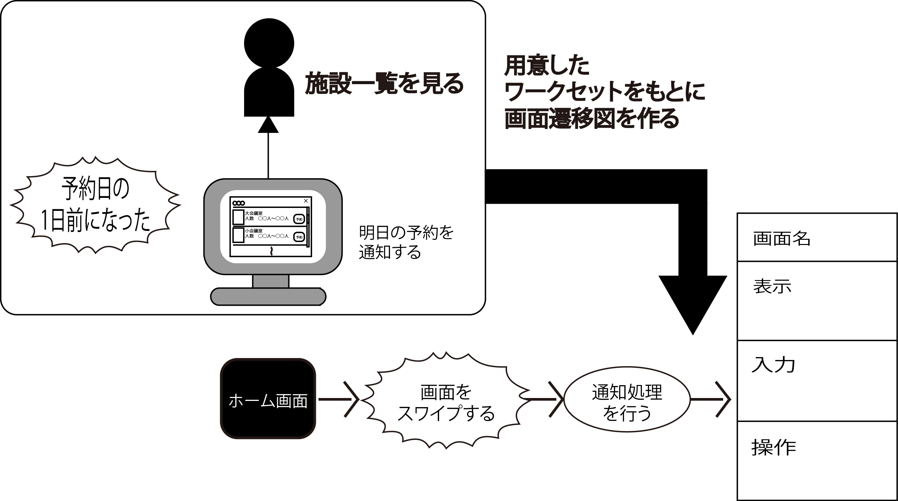

# トリガー

## スワイプなどのイベントトリガー

* スマートフォンやタブレットの場合は、PCと異なるのような操作を行うことがある
    * スワイプ: 指を画面上で滑らせる
    * ピンチイン・ピンチアウト: 複数の指で行う操作
* これらについても当然イベントトリガーとして記載
* 上記の操作が行われた際に実行する機能を明記しておくことが必要

## 非操作系のイベントトリガー

* ユーザの操作なしに処理を行う場合がある
    * 通知を受信した場合
    * 指定時刻になった場合etc
* 上記については、場合によっては行動シナリオやワークセットをそのタイミング用に分離して書き起こしておいて、
* そのうえでやはりイベントトリガーと機能について記載しておく
* 例: ノーティフィケーション時の画面遷移図

