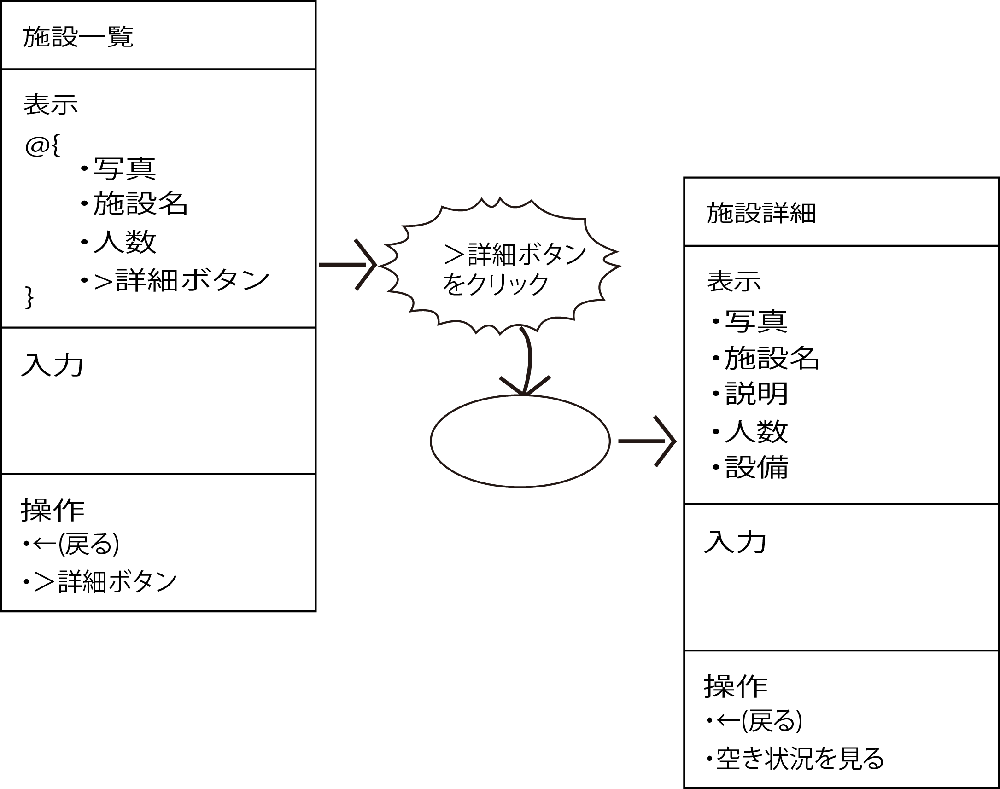

# 操作と機能を折り込む

* 画面遷移図にユーザの操作によって発生するイベントトリガーと、それによって実行される機能を織り込む
* ここでは利用者がどのような操作を行った（イベントトリガー）ら、どのような処理を行う（機能）のかということを考える手掛かりがきちんと明記する
    * このタイミングで実行する機能のタイトル・見出しを明確にするの

## 手順

* [同一画面に戻る遷移](01)
* [開始と終了について](02)

