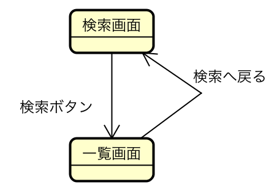
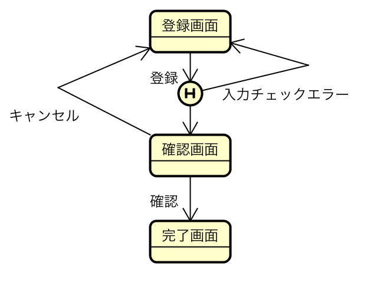

# 動線を考える

* [操作と機能を折り込む](01)
* [ワークセット間の遷移とかメニュー体系](02)

## 画面遷移図の作成

* UI設計ポリシーの画面機能パターンと、ユースケース記述を使用し、画面遷移図を作成する
    * シナリオを実現するにはどのような画面が必要で、それらの画面はどのように関連しているかを図で表現する
* 画面遷移図
    * Webの場合画面遷移は`フォームカリンク`をさす
        * Webであれば暗黙的に画面遷移がサーバーの呼び出しを表す
    * 画面遷移図は頻繁に更新されるので使い勝手が良いツールを選ぶ
    * 画面間の関連を簡単に付け替えられるようなツールを選ぶと良い
        * 条件によって遷移先の画面を切り替えるような場合もある
            * 画面遷移の分岐を表現可能なツールであればなおいい

## 画面遷移図の目的

* ユースケース記述を実現する画面を洗い出す
* ユースケース記述を実現する画面遷移を洗い出す
* ユーザービリティを考慮した画面遷移を洗い出す

## 検索、一覧画面の画面遷移図

* 検索パターンの結果として、一覧画面パターンが表示されることが多い
    * ２つのパターンを合わせて画面遷移のパターンを定義
    * この画面遷移図は、UMLのステートチャート図で書いたもの

## 登録画面、確認画面、完了画面の画面遷移

