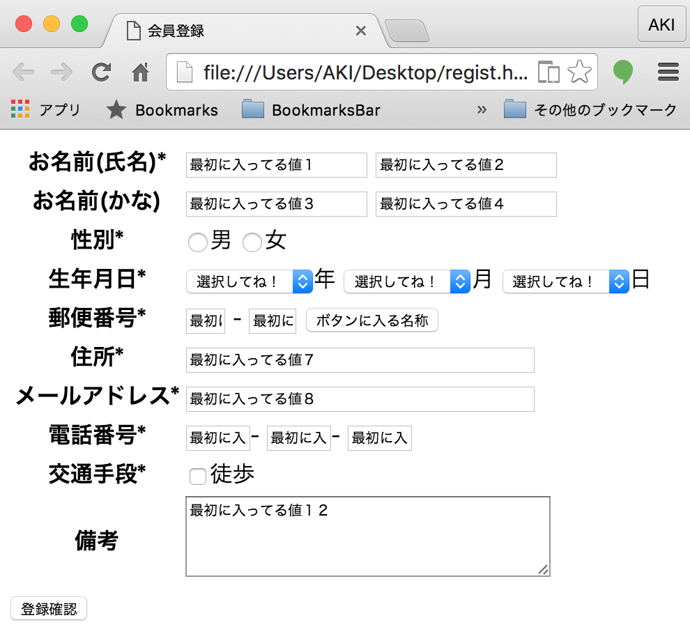
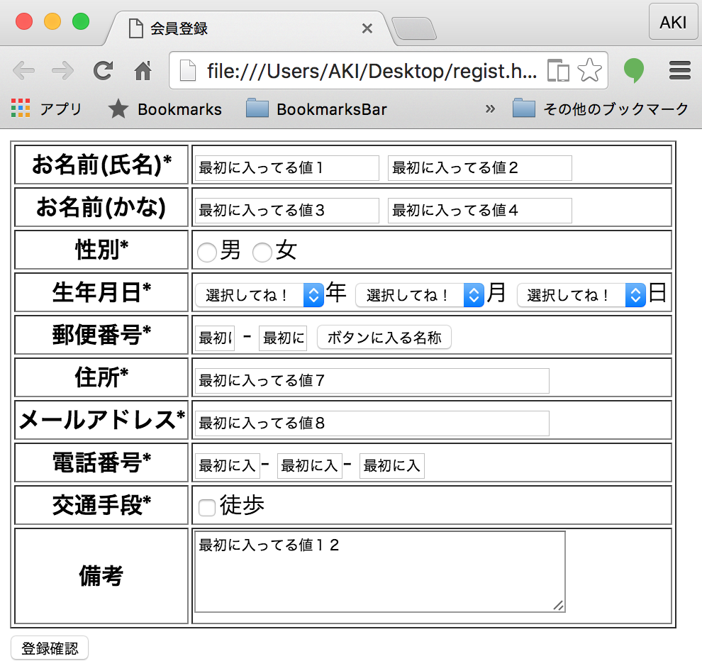
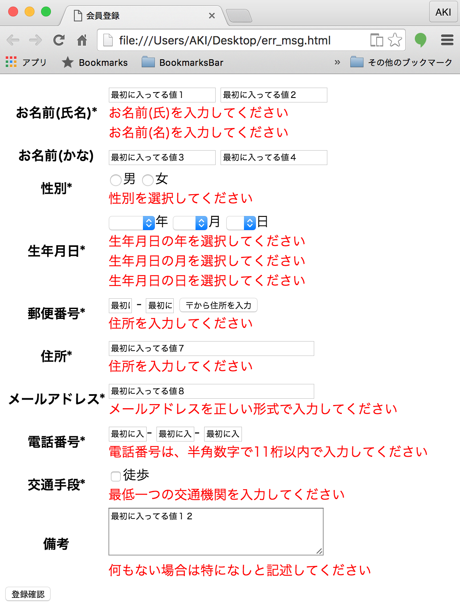

# 画面モックアップの作成

* UI設計ポリシーと画面遷移図を作成したら、具体的な画面イメージを作成する
    * モックアップ: 実物大模型
* 画面設計でも、HTMLファイルを作成して画面モックアップを作成する
    * [登録画面](regist.html)
    * [登録画面(エラー表示)](regist_error.html)

## 画面モックアップの目的

次のものを具体的に検討すること

* 画面項目を明らかにする
* 画面項目の配置を明らかにする
* 画面遷移を確認する
* 実装前の画面イメージを確認する

## 手順

* 画面項目は、概念モデルと対応付けながら、過不足を確認していく
    * 注文画面であれば、概念モデルの注文クラスが持っている属性や関連する概念の過不足を確認
        * 仮に概念モデルに不足があることがわかったら概念モデルを更新する
    * 画面モックアップの時点で、画面項目や画面遷移、その他の画面全般について使用をできるだけ確定する
    * 画面モックアップで確認することが、顧客にとっても開発側にとっても良い
    * 画面モックアップは、実際にHTMLのリンク`<a>`や`<form>`を記述画面遷移可能にすべき
        * 画面モックアップの操作性が格段に上がりる

## 登録画面

### パターン1

### パターン2

## 登録画面(エラー表示)

