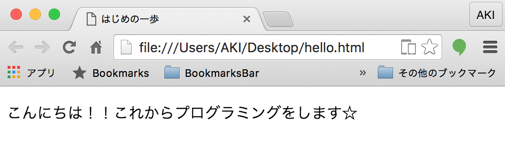
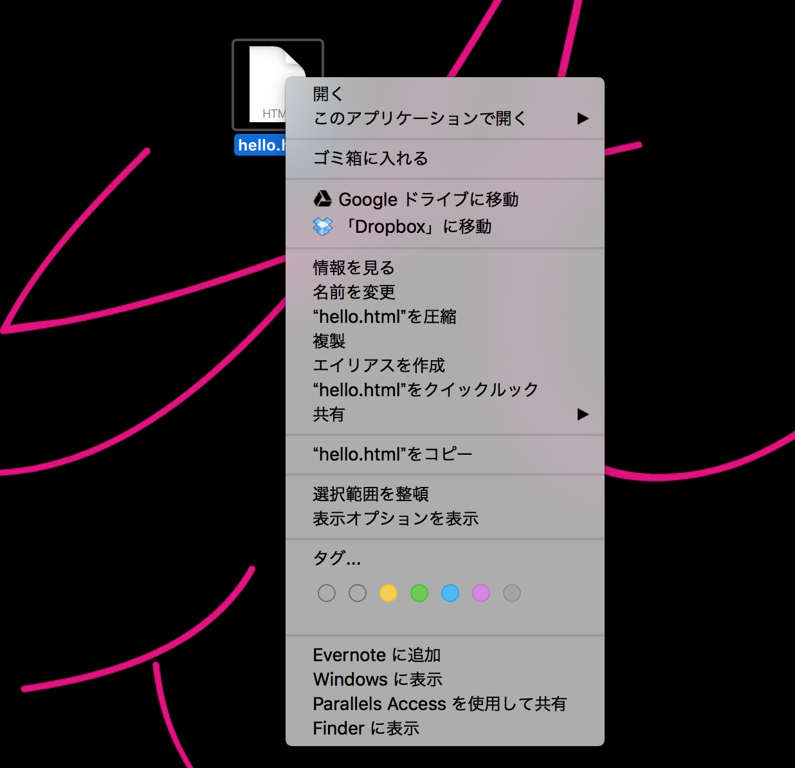
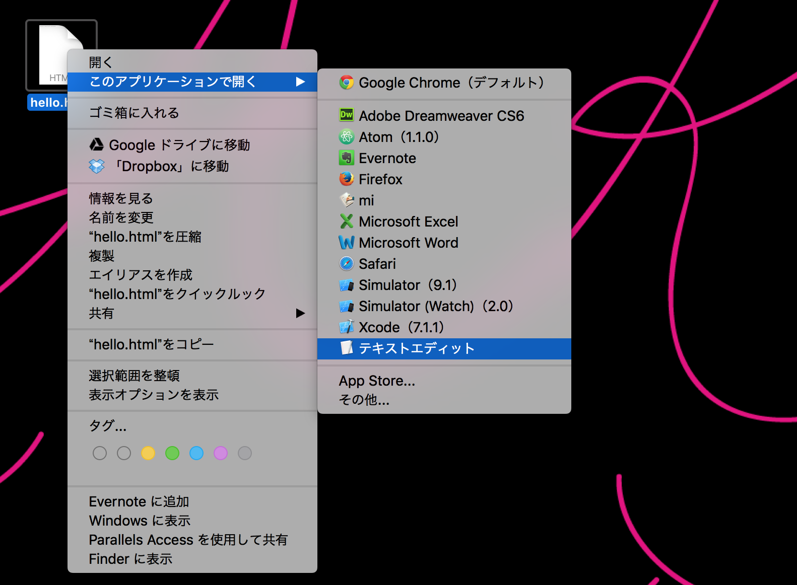
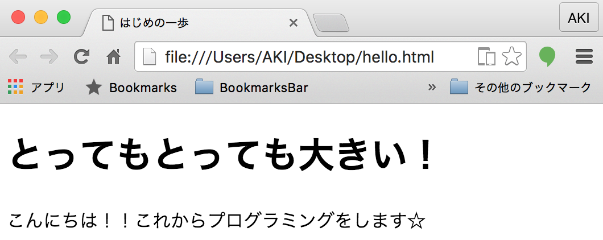
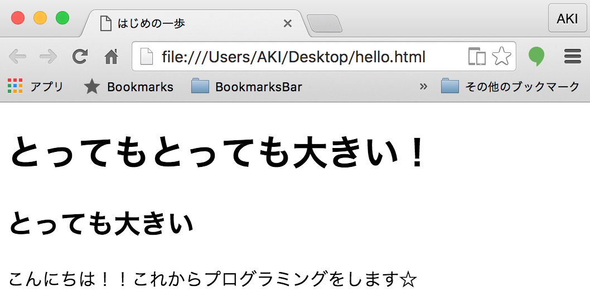
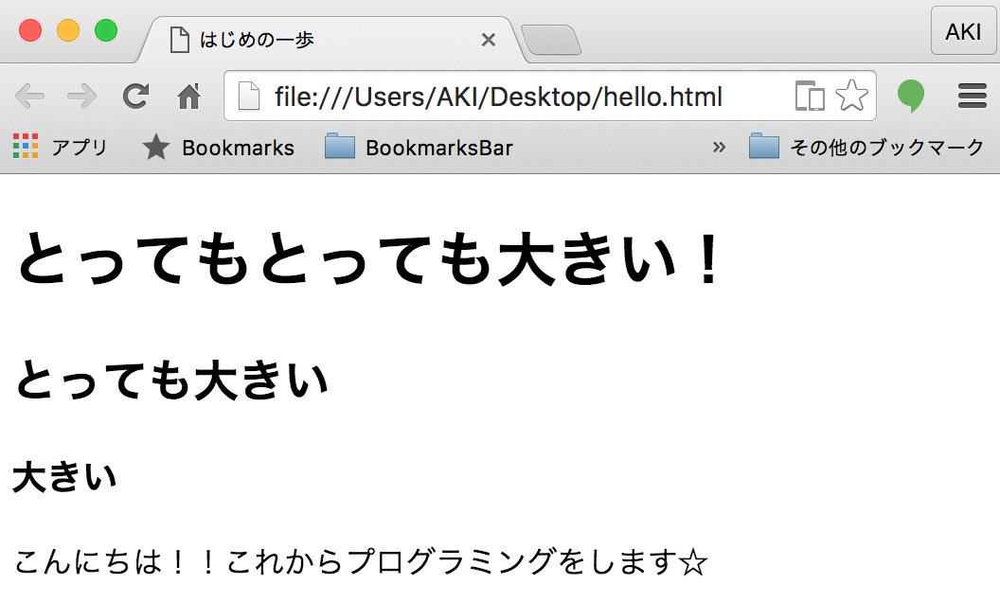
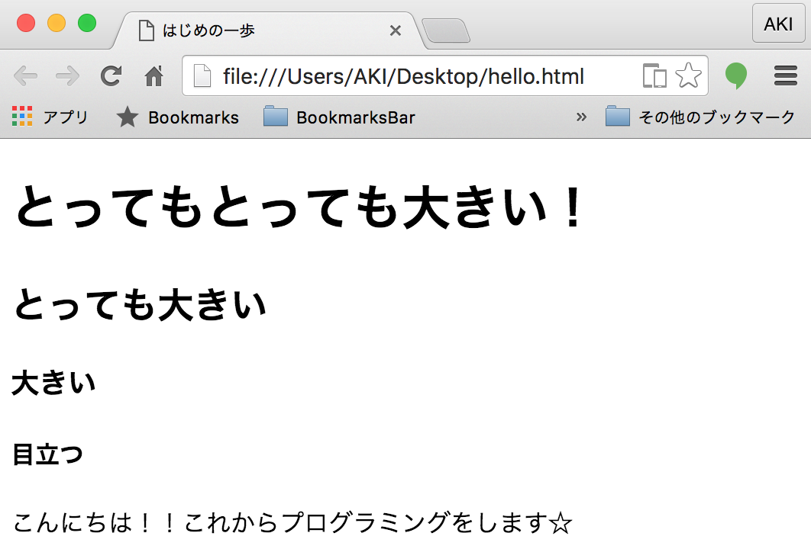
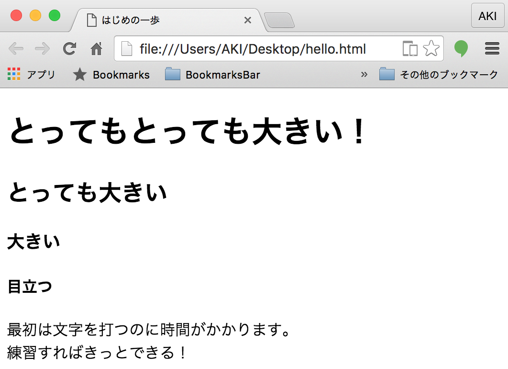
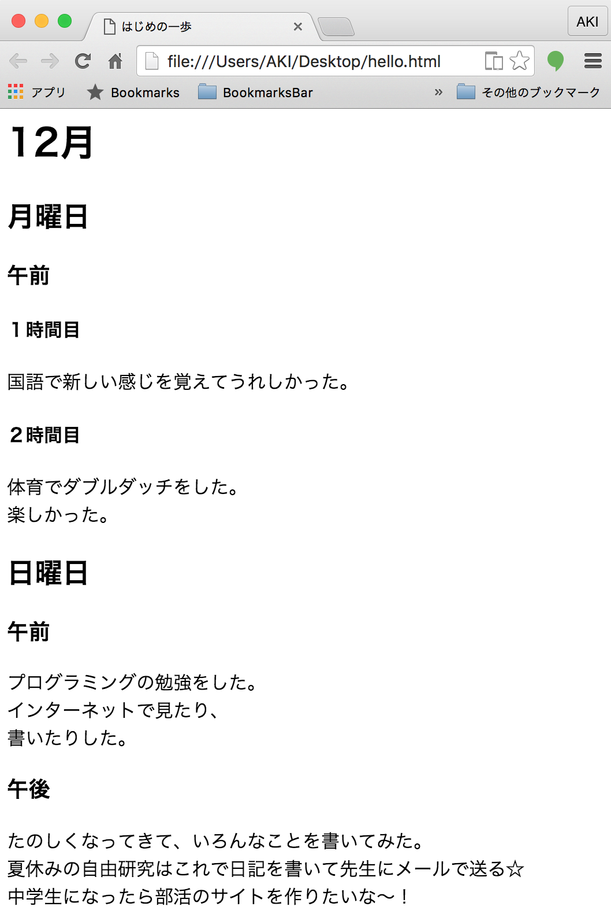

# Webページを表示してみよう

## ファイルを作成する

* ソースコードをデスクトップに保存してファイルをダブルクリック
* 以下のような画面が現れたら成功です



## ファイルを開く

* では、このファイルをテキストエディタ( メモ帳 )で開く
* ファイルの上で右クリック



* 『このアプリケーションから開く』から『テキストエディット』



* テキストエディットや、メモ帳などのように文章を編集するものを**エディター**という

## ファイルを編集しよう

### ファイルの中身の確認

* 先ほどのファイルを開くと以下のような記述がされている

```html
<!doctype html>
<html>
<head>
<meta charset="UTF-8">
<title>はじめの一歩</title>
</head>

<body>

こんにちは！！これからプログラミングをします☆

</body>
</html>
```

### 書き足してみよう

* <body>〜</body>までの中であれば、何を書いても大丈夫なのでガンガン書く
* まずは以下の１行を書き足す

```diff
  <h1>とってもとっても大きい！</h1>
+ <p>こんにちは！！これからプログラミングをします☆</p>
```

<h4>表示してみよう</h4>



### 書き足してみよう

```diff
  <h1>とってもとっても大きい！</h1>
+ <h2>とっても大きい</h2>
  <p>こんにちは！！これからプログラミングをします☆</p>
```



### 書き足してみよう

```diff
  <h1>とってもとっても大きい！</h1>
  <h2>とっても大きい</h2>
+ <h3>大きい</h3>
  <p>こんにちは！！これからプログラミングをします☆</p>
```

### 表示してみよう



### 書き足してみよう

```diff
  <h1>とってもとっても大きい！</h1>
  <h2>とっても大きい</h2>
  <h3>大きい</h3>
+ <h4>目立つ</h4>
  <p>こんにちは！！これからプログラミングをします☆</p>
```

### 表示してみよう



### 書き直してみよう

最後に`<p>` 〜 `</p>`の中を書き直す

```diff
- <p>こんにちは！！これからプログラミングをします☆</p>
+ <p>最初は文字を打つのに時間がかかります。</p>
+ <p>練習をすればきっとできる！</p>
```

### 表示してみよう



`<br>` というのは改行です。次の行に書きたいときに使いましょう。

## 日記を書いてみよう

自由にタイトルをつけて日記を書いてみましょう。



```html
<!doctype html>
<html>
<head>
<meta charset="UTF-8">
<title>はじめの一歩</title>
</head>

<body>

<h1>12月</h1>
<h2>月曜日</h2>
<h3>午前</h3>
<h4>１時間目</h4>
国語で新しい感じを覚えてうれしかった。
<h4>２時間目</h4>
体育でダブルダッチをした。
楽しかった。
<h2>日曜日</h2>
<h3>午前</h3>
プログラミングの勉強をした。
インターネットで見たり、
書いたりした。
<h3>午後</h3>
たのしくなってきて、いろんなことを書いてみた。
夏休みの自由研究はこれで日記を書いて先生にメールで送る☆
中学生になったら部活のサイトを作りたいな〜！
</body>
</html>
```
