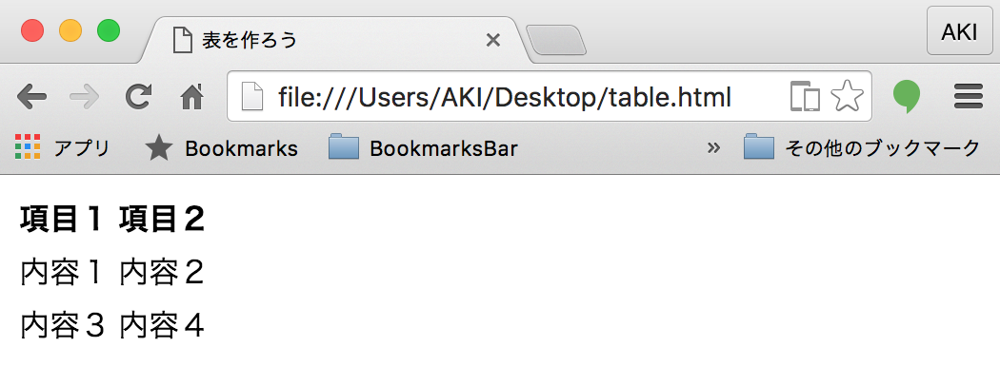
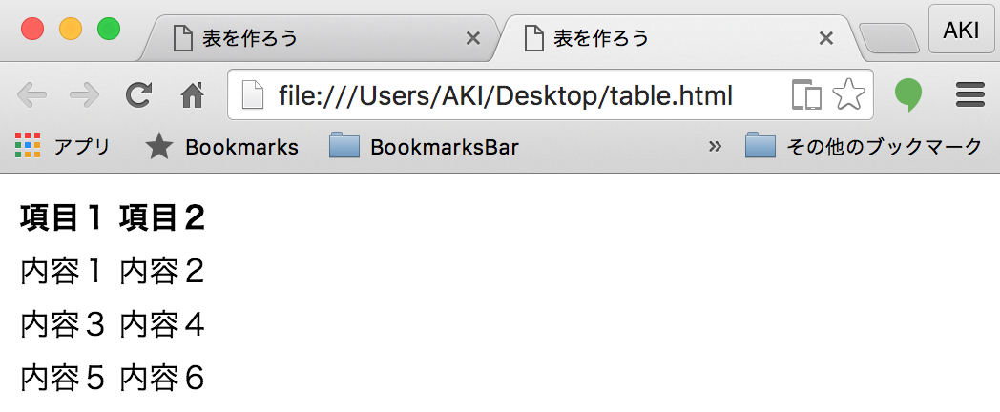
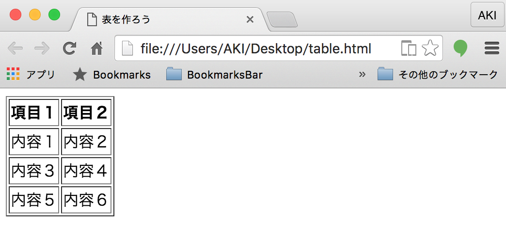

# 表を作ってみよう！

## 表示をしてみよう



```html
<!doctype html>
<html>
<head>
<meta charset="UTF-8">
<title>表を作ろう</title>
</head>

<body>

<table>
<tr><th>項目１</th><th>項目２</th></tr>
<tr><td>内容１</td><td>内容２</td></tr>
<tr><td>内容３</td><td>内容４</td></tr>
</table>

</body>
</html>
```

* タグを使用していないので、改行がされているのがわかる
* `<table>`(テーブル)というのは表のこと

## 書き足してみよう

```diff
  <tr><th>項目１</th><th>項目２</th></tr>
  <tr><td>内容１</td><td>内容２</td></tr>
  <tr><td>内容３</td><td>内容４</td></tr>
+ <tr><td>内容５</td><td>内容５</td></tr>
```

## 表示してみよう



## 書き足してみよう

```diff
- <table>
+ <table border="1px">
```

## 表示してみよう



## 複雑なテーブルを作ろう

```html
<table>
    <tr><th>項目</th><th>説明</th><th></th></tr>
    <tr>
        <td rowspan="2">電話番号</td>
        <td>入力</td>
        <td>市外局番、局番、番号の３つの入力項目とする</td>
    </tr>
    <td>表示</td>
    <td>市外局番、局番、番号を半角ハイフンで区切って表示する</td>

    <tr>
        <td rowspan="2">都道府県</td>
        <td>入力</td>
        <td>リストボックスで表示・選択する</td>
    </tr>
    <td>表示</td>
    <td>テキストで表示する</td>


    <tr>
        <td rowspan="2">住所</td>
        <td>入力</td>
        <td>市区町村、町名番地、アパート・マンション名の３つの入力項目とする</td>
    </tr>
    <td>表示</td>
    <td>市区町村、町名番地、アパート・マンション名を半角スペースで区切って表示する</td>
</table>
```


