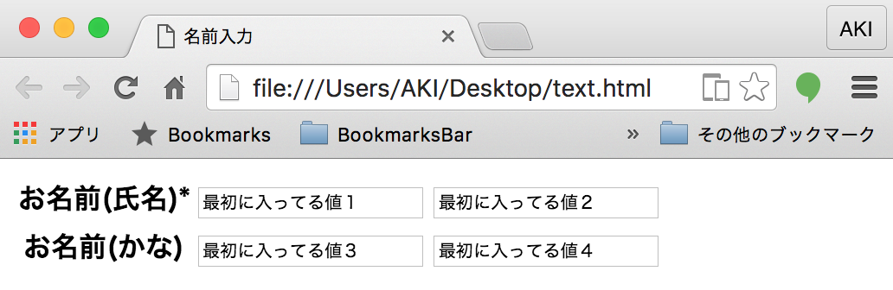

# フォーム

## 名前入力フォームを作ろう

```html
<pre class="brush:html toolbar:false;">
<!doctype html>
<html>
<head>
<meta charset="UTF-8">
<title>名前入力</title>
</head>

<body>
<form>
お名前(氏名)<span class="red">*</span>
<input type="text" value="最初に入ってる値１" />
<input type="text" value="最初に入ってる値２" />
お名前(かな)
<input type="text" value="最初に入ってる値３" />
<input type="text" value="最初に入ってる値４" />
</form>
</body>
</html>
```

## 表示してみよう


## テーブルを利用してみよう

```html
<form>
<table>
<tr>
  <th>お名前(氏名)<span class="red">*</span></th>
  <td>
      <input type="text" value="最初に入ってる値１" />
      <input type="text" value="最初に入ってる値２" />
  </td>
</tr>
<tr>
  <th>お名前(かな)</th>
  <td>
      <input type="text" value="最初に入ってる値３" />
      <input type="text" value="最初に入ってる値４" />
  </td>
</tr>
<tr>
</table>
</form>
```

## 表示してみよう



## ラジオボタンを作ろう

```html
<form>
性別
<input type = "radio" name="gender" value = "0" >男
<input type = "radio" name="gender" value = "1" >女
</form>
```

## 表示してみよう


## 改造してみよう

```diff
  <form>
+   <table>
+     <tr>
+       <th>性別<span class="red">*</span></th>
+       <td>
          <input type = "radio" name="gender" value = "0" >男
          <input type = "radio" name="gender" value = "1" >女
+       </td>
+     </tr>
+   </table>
  </form>
```

## 表示してみよう


## プルダウンメニューを作ろう

```html
<form>
生年月日<span class="red">*</span>
<select name="year" >
  <option selected>選択してね！</option>
  <option value="1900">1900</option>
</select>年

<select name='month'>
  <option selected>選択してね！</option>
  <option value="12" >12</option>
</select>月

<select name='day'>
  <option selected>選択してね！</option>
 <option value="1">1</option>
</select>日
</form>
```

## 表示してみよう


## 改造してみよう

```diff
  <form>
+   <tablee>
+     <tr>
+       <th>生年月日<span class="red">*</span></th>
+       <td>
          <select name="year" >
            <option selected>選択してね！</option>
            <option value="1900">1900</option>
          </select>年

          <select name='month'>
            <option selected>選択してね！</option>
            <option value="12" >12</option>
          </select>月

          <select name='day'>
            <option selected>選択してね！</option>
           <option value="1">1</option>
          </select>日
+       </td>
+     </tr>
*   </tablee>
  </form>
```

## 表示してみよう

## チェックボックスを作ろう

```html
<form>
交通手段<span class="red">*</span>
<input type="checkbox" />徒歩
<input type="checkbox" />電車
</form>
```

## 表示してみよう


## 改造してみよう

```diff
  <form>
+   <table>
+     <tr>
+       <th>交通手段<span class="red">*</span></th>
+       <td>
          <input type="checkbox" />徒歩
          <input type="checkbox" />電車
+       </td>
+     </tr>
+   </table>
  </form>
```

## 表示してみよう


## テキストエリアを作ろう

```html
<form>
備考
<textarea rows="4" cols="40">最初に入ってる値１２</textarea>
</form>
```

## 表示してみよう


## 改造してみよう

```diff
  <form>
+   <table>
+     <tr>
+       <th>備考</th>
+       <td>
+         <textarea rows="4" cols="40">最初に入ってる値１２</textarea>
+       </td>
+     </tr>
+   </table>
  </form>
```

## 表示してみよう


## 送信ボタンを作ろう

```html
<form>
<div><input type="submit" value="登録確認" /></div>
</form>
```

