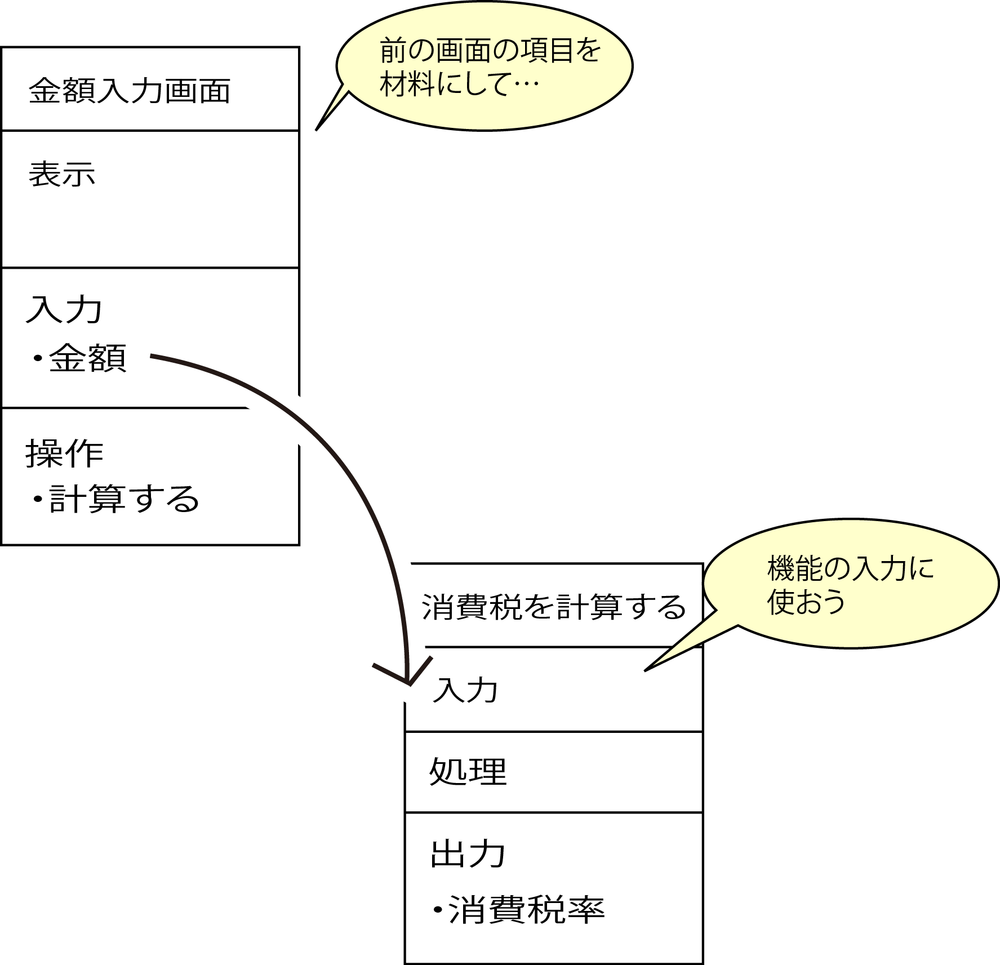
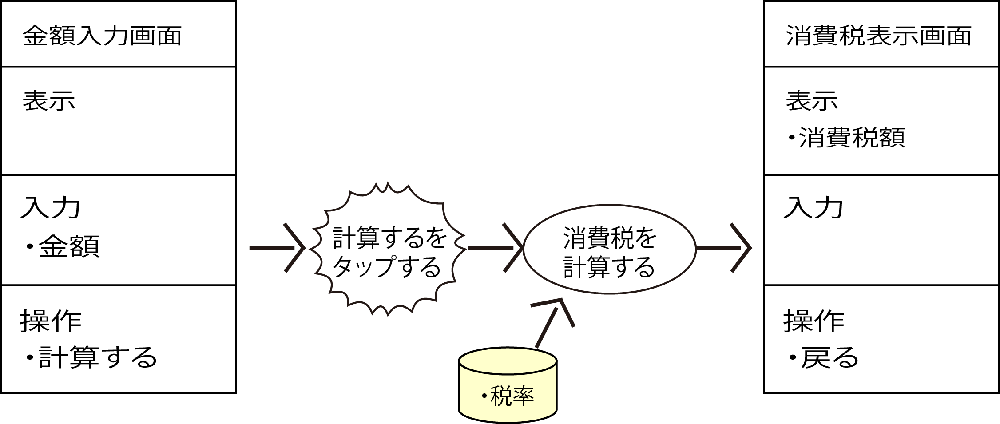

# 入力を決める

## 出力のための材料＝入力

* 出力を決めたら、その出力を作るために必要な材料としての入力を決める
    * 入力はその機能が動作するきっかけを与えるイベントトリガーが発生した遷移元の画面にある項目
    * 入力を与えればこの出力が得られる
        * これが`interfaceを定義する`ということになる
            * ここでいうinterfaceはUIとは異なって、APIなどの、よりプログラミング的なほうによった意味
            * 関数として表現すると下記のようになる
                * `消費税＝消費税を計算する（金額）`
                * `目玉焼き＝目玉焼きを作る（卵）`
    


### 調達元としてのDBの追加

* 画面に材料となる情報がない場合
    * 画面以外のところから必要な材料を調達する
    * その調達の仕事＝機能が追加で必要になるわけ
    * 大抵の場合はDBから調達してくる
        * そこでワークセットの画面遷移図の機能のところに、画面からだけでは足りない分を持ってくるための調達元としてのDBを追加



```text
この出力をするにはこの入力だけでは足りない、ということを判断するためには、
そもそも出力するためには何をどうするのかということが明確にしなければならない
出力を決めたら、それを実現するための入力と同時に、出力を作り出すための手順、つまり処理というものを考えないといけない
```

