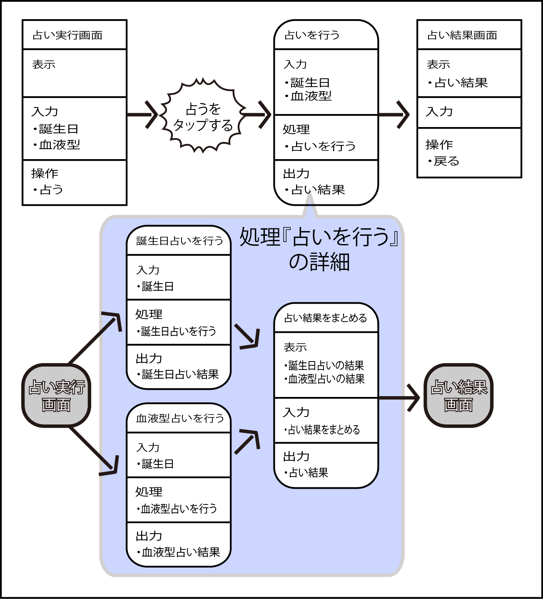
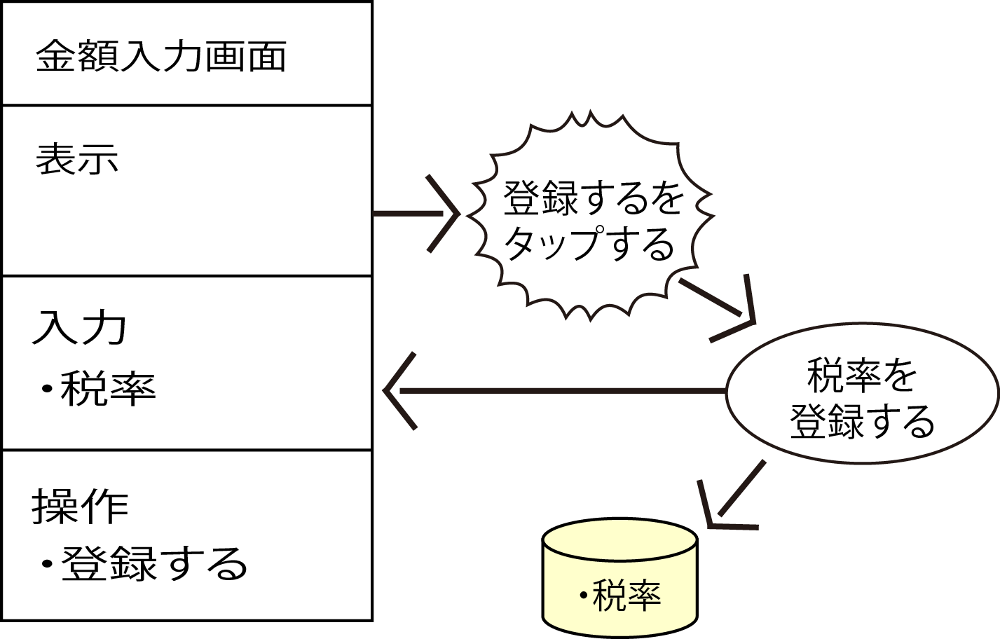

# 機能を分割する

* 別機能として切り出して定義をしておく
    * 段下げ（入れ子）が深くなっていくと、だんだんと混乱する
    * また、最終的には1つの成果に結びつくとしても、個別にみていくと異なる仕事であることがよくある

* この場合、画面遷移図に全部を書いていくと猥雑
    * 画面遷移図に表れている機能をトップノードとするべき
        * それ以下のレベルのものを１つのセットとしてまとめておく
    * 分割した場合も、それぞれの小さな機能はそれぞれごとに１つの仕事であり成果をきちんと出すべきもの
    * そしてその成果が連鎖することで１つの大きな仕事＝トップノードの機能を実現するということを意識する

## ストア系の機能

* 機能の中には受け取った材料を保管するという仕事を行う場合もある
    * DBにデータを保存するのはその典型
        * DBを書いておく必要がある
        * そのワークセットの画面遷移図の中の機能ところにもDBを追加しておく必要がある

## 機能について考えた結果をまとめる

* ここまでの作業で1つのワークセットの中の1つの機能について考えてた
* ワークセットの中の残りの機能についても、同様の手順を繰り返す
* そして最終的にはすべてのワークセットの機能に対して、この手順を行う
    * その結果、UI定義と合わせて次の成果が出来上がる
        * ラフイメージまたモックアップ
        * 画面遷移図
        * 項目の説明
        * 機能の入出力定義
        * 機能の処理定義

次は、UIと機能についての成果を材料にして、各機能によって共有されるDBの詳細について定義していく

