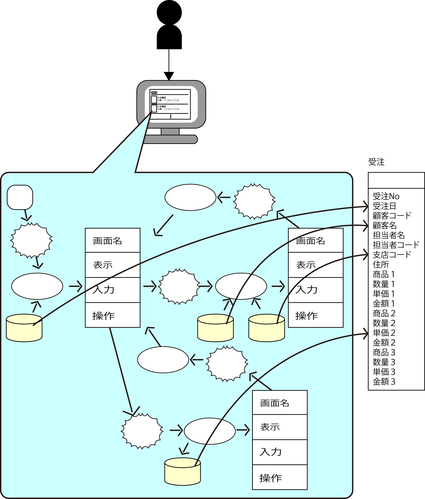
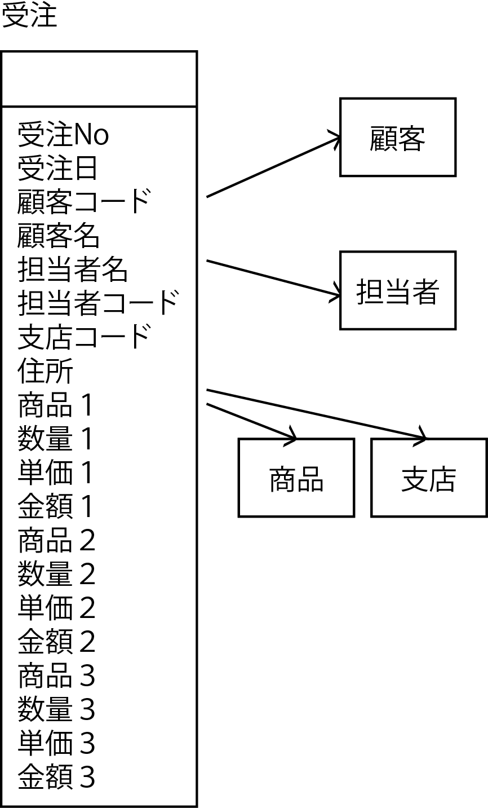
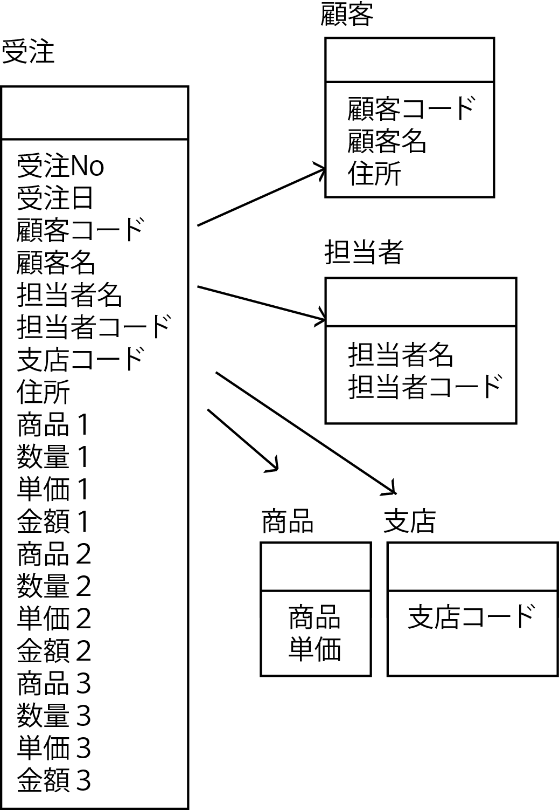
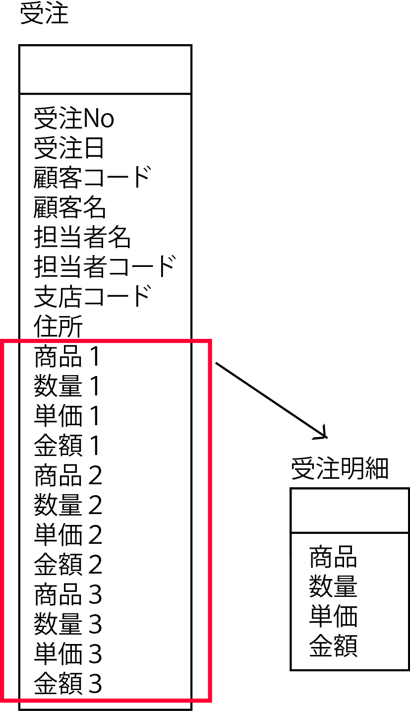

# DB設計の方法

* 最小限の基本的な手順
    * ワークセット単位で設計する
    * 1の成果を1つに統合する
* これらの成果として一般的にはERDあるいはER図と呼ばれるDB設計の図面ができあがる

## ワークセット単位で設計する

* これまでの成果の中からワークセットを1つ選択
    * そのワークセットのこれまでの成果一式を用意
    * そこに書かれているDBの項目を全部書き出し
        * このときに、機能やUIの項目などについても、DBにあるはずの項目がドラム缶から漏れていないかを確認

### 項目の区分け = 正規化

* 項目を全部書き出したら、適切なまとまりに区分けしていく
    * これを正規化とも呼ぶ
* 区分けの方法は、まずは器(エンティティ)を用意する
    * 器を見いだすには、名詞・動詞法がおすすめ
        * 一般にイベント系・リソース系と言うような見分け方をする方法

#### イベント系(動詞)

動詞で表現できるもの

* まずはワークセットの主役・核となるエンティティを見いだす
    * ワークセットは何らかの仕事を行うためのもの
    * その`仕事を表現する物`が主役
        * 例: 「注文」「予約」etc
    * これらは「～する」という言い方ができる
    * つまり動詞にすることが可能
* イベント系の特徴は`タイムスタンプを入れられる`ということ
    * 「いつ～する」という風に言えるとイベント系と目する事ができる

#### リソース系(名詞)

* 脇役
    * 例: `商品を注文する`というワークセットの場合
        * `商品`を注文する
        * `商品`というエンティティが脇役として必要になる
* これらはイベント系と違って「～する」という言い方ができない
    * つまりこれらは名詞
* このような名詞で表現できるものは「リソース系」

#### エンティティを見いだす

Ph.1で作成した概念データモデルを参照しながら設計を行う

* 器としてのエンティティが並んだら、先ほど列挙した項目をそれぞれのエンティティに振り分ける
    * このときにさらに適切なエンティティを用意したほうがよいと感じたら、どんどん追加する

### 繰り返し項目の外部化

* 繰り返し項目のグループを切り出して、いわゆる見出し明細形式にする
    * これがいわゆる第一正規化になる
    
    

### リレーションシップの設定

* エンティティの間の参照関係(リレーションシップ)を定義する
* RDBMSの場合は主キー設定とその参照を定義することになる
