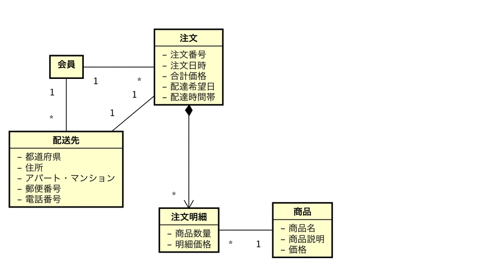

# 概念モデルの書き方

* 何が概念なのかを洗い出す
* 概念となるべき候補をユースケース記述から洗い出す

## 前提条件

* ユースケース記述などがある程度書かれている

## 例: 注文に関わる概念

* 注文
* 注文番号
* 注文日時
* 合計価格
* 購入者
* 配送先
* 商品数量
* 商品価格
* 商品名
* 商品説明

## 注文を描く

* 中心となる概念を置く
    * ([『操作区画の表示』のチェックを外す](00_astah))

## 注文番号を置く

* 注文番号は、注文を必ず一意に識別するもの
* 注文には必ず一つだけ注文番号があるとすれば、注文と注文番号は１対１の関連となる
* `1対1の関連`は属性にすることができる

* 同様に注文日時と合計価格も注文の属性にする

## 次は購入者と配送先

* このシステムでは、会員登録されている会員だけが注文できることにする
* 会員が購入者になる
* 会員はたくさん注文可能
* １つの注文の購入者は一人の会員
* 会員と注文は`１対多`になる
* 会員と注文の多重度が１対１ではない
    * 注文とは別のクラスにする

* 配送先が単純に住所を文字列として持つだけの場合
* 注文の属性にしてしまっても良い

* 配送先の情報が構造を持つようであれば、別のクラスに分けた方がわかりやすい

* 配送先を会員ごとに登録しておける場合
    * 会員にもたせても良い
* 今回は、会員に配送先を複数登録可能にし、注文時にその中から配送先を一つ選択させる

* 配達先のモデルとしてどれが良いかは、要件によって決まる
* ここではさらに配達希望日と配達時間帯は注文時に指定するようにする

## 注文の商品数量/商品価格/商品名/商品説明を検討

* 商品価格と商品名と商品説明は、商品固有の属性であり、他の注文でも同じ情報を使用

## 商品

* 商品数量は商品固有の情報ではなく、注文に関連した情報
* 注文と商品を結びつける注文明細クラスを置く
    * 注文クラスを置いて商品数量を属性にする
    * 注文明細クラスは注文に含まれる商品の種類ごとに作成されるクラス
* 関連の線に矢印と黒い菱形: コンポジションを表現
    * コンポジションは集約の一種
    * 「全体と部分」を表現
    * 注文明細は注文の部分であるということ
* 価格についても注文明細に重複して持たせ値上げなどで商品の価格が変更される可能性に対応
    * 商品クラスは商品マスタとでもいうべきもの
        * 商品クラスの価格が変わっても注文の価格は注文時のまま
* 注文明細に明細価格を持つ

## 描かれるモデルは異なる

描かれるモデルは要件により異なる

* 要件理解の深度
* 視認性
    * 視覚的に物事をわかりやすくする
    * 構造が複雑なものを分けて表現するなど
* 拡張性

## 抽象化

* 例: 決済情報を追加する
* 注文に注文決済を持たせる
    * 注文決済は、注文時に会員が選択して入力する決済情報を抽象化
    * 決済情報を具象クラスとする
        * クレジットカード決済と銀行振込決済のどちらか一つを選択可能になっている

## 概念モデルの注意点

### 概念モデルの目的

* 概念の名前を整理する
* 概念の関連を整理する
* 概念の関連の多重度を整理する

### 概念の名前の整理

#### 名前整理の注意点

* 同じ意味で２つの言葉があれば１つにする
    * できるだけエイリアス、シノニム、ホモニム、を排除
* 違う意味で１つの言葉があれば分解する
    * 注文: 受注と発注に分解etc

#### 関連の整理の注意点

* 概念モデリングに慣れない間は、関連の線を無駄に増やしがち
* 概念モデルでは冗長な関連はつけないようにする
    * 例: 会員が過去に購入した商品を一覧で表示する機能
        * 会員と商品を直接関連付けたくなるが、これは冗長すぎる関連
        * すでに会員と商品は、注文と注文明細を経由して関連してるため
        * さらに会員と商品を関連付けると、二重で関連付けられることになる
        * 注文の返品キャンセルが発生した場合に、注文と注文明細は削除した
            * 会員と商品の間の関連を削除し忘れる恐れがある

#### 関連の多重度の整理の注意点

* 主に注意すべきは、１対１の多重度と多対多の多重度
    * 多対多の多重度は以下の点を慎重に考慮
        * 本当にその関連が必要か？
        * 関連の間に新しい概念が存在しないか？
    * 会員と商品との関連であれば、注文と注文明細を経由する
        * 会員と商品との関連は不要

## ERDの統合

* ワークセット別のERDを1つのERDに統合する
    * 統合は、同じ名前のエンティティを1つにまとめていくという方法で進める
        * この際に新たにエンティティを見いだしたりすることもある
        * エンティティ名や項目名を修正することもある

## データについて考えた結果をまとめる

ERDが統合された結果の成果物

* ラフイメージまたはモックアップ
* 画面遷移図
* 項目の説明
* 機能の入出力定義
* 機能の処理定義
* 統合ERD
