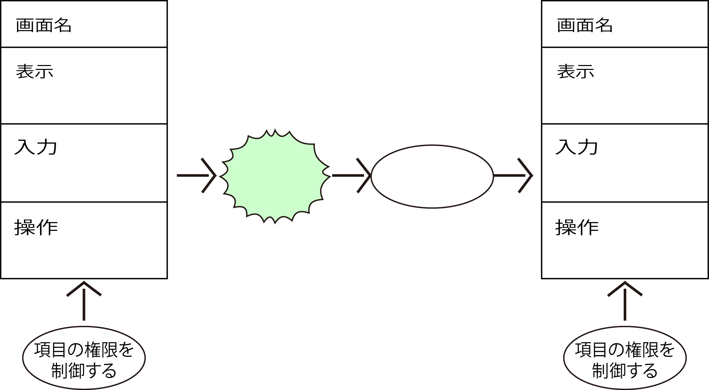
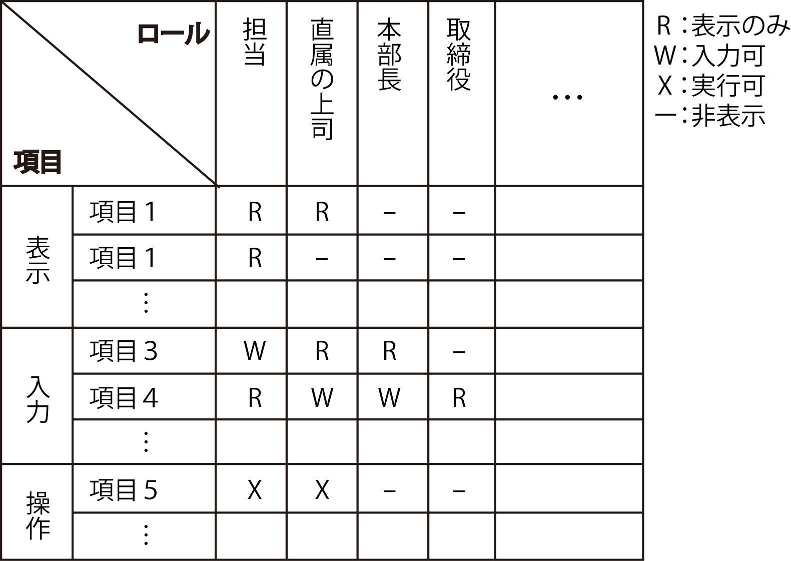
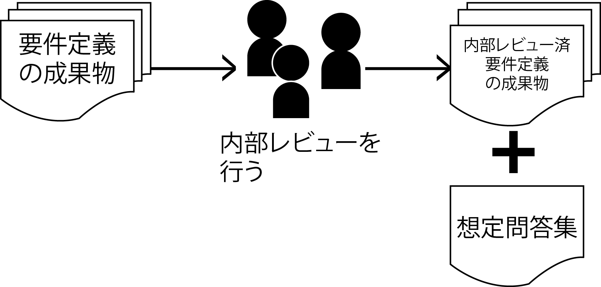

# 仕上げ

* 足りないワークセットを検証
    * 「要件定義が不十分」とならないために行う
* データベースを利用して検証
    * DB設計の成果を使って、不足しているワークセットがないかを確認
    * ここまでしなくても次の工程には渡せる
* CRUDマトリックスを作る

## 精度を高めよう

```text
追加の行動シナリオを用意して、見いだしたエンティティに対するワークセットを追加したら、
そのワークセットの要件定義の3要素を改めて先ほどまでの手順に従って定義していく
```

* 再びCRUDマトリックスに追記して検証を行う
* ワークセットを追加したらそれを利用する行動シナリオを定義することになる

## 仕上げ

* プロジェクトの必要性に応じて、応答性や可用性などの各種の非機能要件を定義
    * 非機能要件: いわゆるビリティ系

### 権限別のワークセット・行動シナリオ

* 権限ごとにワークセットを分ける
    * ワークセットが分かれることはそもそもの行動シナリオが異なる
    * 同じことしかしないのであれば行動シナリオは同じでよい
    * 同一の仕事をするのであれば同一の権限でよい
* そうでないなら役割(ロール)別の行動シナリオやワークセットが必要になる

#### 権限管理の機能を置く

* 同一のワークセットにおいて権限別の制御を行う必要が生じる場合
    * ワークセットに必ず`権限別の制御をする`という機能をUIごとに置く



* 処理内容を考える
    * 具体的にいつ行うのか(イベントトリガー)
    * 何をどう制御するのか
* 処理内容は表を用意する



## 成果物を確認

この時点で、成果物としては次のものが揃っているはず

* 企画書
* 全体像(オーバービュー)
* 利用する実装技術
* 実現したいこと一覧(要求一覧)
* 行動シナリオ
* 概念データモデル
* ラフイメージまたはモックアップ
* 画面遷移図
* 項目の説明
* 機能の入出力定義
* 機能の処理定義
* 統合ERD

## あと工程に渡す準備

詳細設計を行う人定義した要件をきちんと伝える準備

### 一覧を作成

* 良い一覧は、それだけで全体への理解を大きく進める
* 良い一覧は、個別の問題を分割統治するための土台となる
* 羅列ではなく`構造化`した資料を用意する
    * 構造化とは箇条書きでもある
        * これまでの成果物の目次化を行う
            * 行動シナリオ一覧を作成
            * ワークセット一覧を作成
* この一覧の作成において、はブブロック図が有効

### 想定問答集を作成

<p>これらの一覧を加えると、現在の成果物は次のものになる

* 企画書
* 全体像(オーバービュー)
* 利用する実装技術
* 実現したいこと一覧(要求一覧)
* `行動シナリオ一覧`
* 行動シナリオ
* `ワークセット一覧`
* 概念データモデル
* ラフイメージまたはモックアップ
* 画面遷移図
* 項目の説明
* 機能の入出力定義
* 機能の処理定義
* 統合ERD

この成果物一覧の中で、今追加した2つの一覧の位置に注目

* 実はこの成果物一覧の順序で説明していく
    * これは、受け手にとって段階理解しやすい
    * 段階理解: `全体から詳細へ`、`WhyからWhatへ。WhatからHowへ`
* この一覧を説明資料の目次そのものとして使えるようになる
* ここに表紙を付ければ説明用資料の出来上がり
* あとは、この流れに沿って順番に説明すればOK
    * 「ただいまより、本プロジェクトの説明をします」
    * 「まず、本プロジェクトがどのようなものかを説明します」
    * 「本プロジェクトの名称は、(企画書のプロジェクト名称)です」
    * 「本プロジェクトの目的は、(企画書の目的)です」

### 予行練習

* 成果物担当者の側のレビューを行う
* 質疑応答の想定をして、想定問答集を作る
    * 内部レビューの成果は想定問答集
    * 重要なのは、そのような想定問答が予測されるなら、その質問自体が発生しなくても済むように、資料自体に自明となるように手を加えること



## 最後に

* 最重要なのは画面遷移図
    * 間にイベントと機能を図示
* 企画と実装の間のブリッジが要件定義
    * ほかの工程と混ざっているところをはぎ取るとった結果、`UI、機能、データ`と、それらを図示した画面遷移図が残る
* 非機能要件も含める
* アジャイルでも決めるべき3点セットは変わらない
    * ストーリーカードなどは行動シナリオやワークセットの定義に相当する

## example

### 要件の書き出し

* 会議室予約システム
    * システムで、どんなことができると嬉しいかを、箇条書き
    * 実現したい要件は以下
        * 会議室の予約や予約取り消しを行いたい
        * 時間変更や会議室変更可能にしたい
        * 会議室のダブルブッキングが生じないチェックしたい
        * 会議の出席者も管理したい
        * 今日の会議予定を一覧で表示してほしい
        * 将来は会議の出席予定者に対して、予約時に「出席依頼メール」を、当日朝に「リマインドメール」を送信したい
