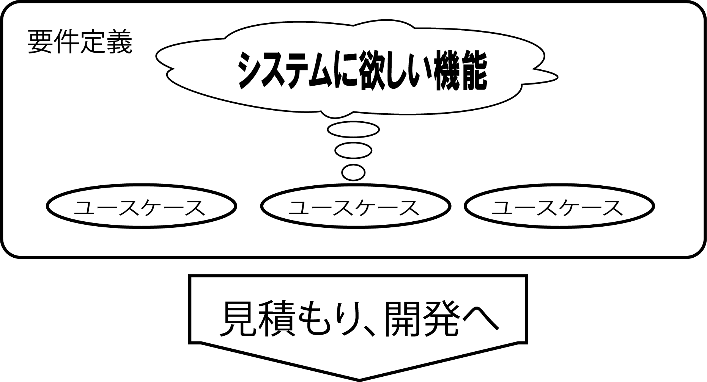
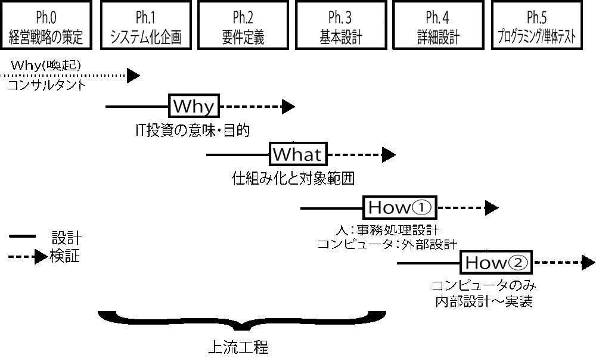

# ph.2: 要件定義

* `プログラマがソフトウェアを完成させるために必要な情報`を揃える
    * UI
    * 機能
    * データ
* リクエストされた成果物を明確にする

## 前提条件

以下が揃っていること

* 企画書
* 全体像(オーバービュー)
* 利用する実装技術
* 実現したいこと一覧(要求一覧)
* 行動シナリオ
* 概念データモデル

## TODO

* [概要](00_about)
* [事前準備](01_prepare)
* [UIを決める](02_ui)
    * `UIを通じて`ソフトウェアを操作すること
* [機能を決める](03_function)
    * 操作に対して`機能が動作`すること
* [データを決める](04_data)
    * `機能が必要とするデータ`が揃っていること
* [仕上げ](05)

