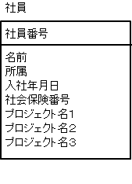

# 第1正規形

* テーブルのすべてのカラムが、これ以上分割できないカラムで構成されているテーブルのこと
    * 分割できないカラム: 繰り返し構造のないテーブルのこと

## スカラ値

* これ以上分割できない値をスカラ値と呼ぶ

## 例

以下のようなテーブルを想定

* 社員テーブル
    * この会社では、社員は複数のプロジェクトにアサインされることがある
    * カラムとして以下を持っている
        * プロジェクト名１
        * プロジェクト名２
        * プロジェクト名３
    * 所属するプロジェクト名をカラムとして持っている
    * 4つ目のプロジェクトにアサインされてしまうと破綻する
    * プロジェクト名が`繰り返し構造`になっている
    

### 正規化する

第1正規形にするには、プロジェクトを別のテーブルにする

