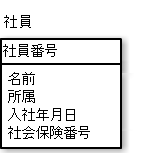
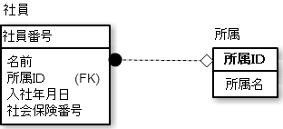

# 第2正規形

* 全ての非キーカラムがすべての候補キーに対して**完全関数従属**する場合のテーブルのこと
* 全ての非キーカラムがすべての候補キーに対して**部分関数従属しない**テーブル

## 前提条件

あるテーブルが第1正規形であること

## 用語

* 候補キー
* 完全関数従属
* 部分関数従属

## 候補キー

* その行を一意に特定することができるカラム
* もしくはカラムの集合を指す
* 候補キーの中から1つが主キーになることができる
* 行には必ず候補キーが1つ以上(主キーを含む)ある

### 例

* 以下の社員テーブルには候補キーが複数ある
* 下記の2つは単独のカラムで候補キーになる
    * 主キーである社員番号
    * 社会保険番号
        * 社会保険番号は、社会保険庁が正しく管理している限り、一意に特定可能
* 所属している部署に同姓同名の人がいない場合は、所属IDと名前でも候補キーになる

* 候補キー
    * 社員番号
    * 社会保険番号
    * 所属IDと名前

## 完全関数従属と部分関数従属

### 関数従属

* Aが決まるとBも必ず決まる関係
    * `A→B`と表記できる
        * A: `決定項`
        * B: `従属項`
* 先ほどの候補キーの話でいうと、
    * 社員番号が決まると社員が決まる
        * `社員は社員番号に関数従属する`
    * 社会保険番号が決まると社員は決まる
        * `社員は社会保険番号に関数従属する`
    * 社員は所属IDと名前にも関数従属する

### 部分関数従属

* 決定項である候補キーの部分に関数従属すること
    * 非キーカラムが候補キーに部分関数従属してはならない
* 主キー以外の項目に関数従属している状態を部分関数従属

#### 例

* 社員番号が決まると入社年月日も決まる
    * 入社年月日は社員番号に関数従属している
    * 所属名も、社員番号に関数従属している

ここで、部分関数従属の登場

* 所属名は所属IDに関数従属している
    * 所属名は所属IDがわかればわかる
* 所属IDは、候補キーの`部分集合`

#### 部分集合

* 集合Aが集合Bの部分集合であるとは、AがBの一部(あるいは全部)の要素だけからなること
    * AがBの一部分であるという意味で部分集合という
    * 二つの集合の一方が他方の部分集合である時、この二つの集合の一方が他方の部分集合である時、この二つの集合の間に包含関係があるという

* 候補キーに対して部分関数従属していると、第2正規形ではない
* 第2正規形にするには、分割する
    * 第2正規形は、候補キーへの部分関数従属を禁じる
        * 所属に同姓同名が許されているならば、所属IDは候補キーの一部ではなくなる        

