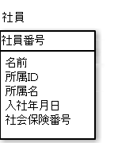
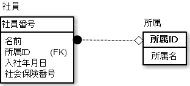

# 第3正規形

あるテーブルが第2正規形であり、なおかつすべての非キー属性がすべての候補キーに非推移的に完全関数従属する場合のテーブルのこと

## 概要

* 第3正規形は候補キーへの推移的な関数従属を禁じる
    * 第2正規形は、候補キーへの部分関数従属を禁じていた
* 推移的な関数従属: `A→B→C`と表記するもの
    * Aが決まるとBが決まり、さらにBが決まるとCも決まるという関係

### 例

* 前提
    * 社員の候補キーにはの３つがある
        * 社員番号
        * 社会保険番号
        * 所属IDと名前
    * `所属IDと名前`が候補キーになるのは、同じ所属に同姓同名を配属しないケースのみ
        * 同じ所属に同姓同名を配属する場合は、`所属IDと名前`は候補キーではない
* 上記の場合でも、第3正規形を使うことできれいに正規化できる

* 以下は推移的な関数従属
    * 社員番号
    * 社会保険番号
    * 所属IDと名前
* 社員番号が決まると所属IDが決まり、さらに所属IDが決まると所属名が決まる
* つまり、`社員番号→所属ID→所属名`
    * 所属IDと所属名が候補キーでなくても、第3正規形で整理できる
