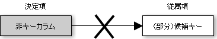

# ボイスコッド正規形

* あるテーブルに存在するすべての関数従属の決定項が、候補キーであるテーブルのこと
    * 第2正規形や第3正規形では満たされない場合がある
    * 候補キーが非キーカラムに関数従属するようなケース
        * 候補キーが単一のカラムならばこのようなケースはあり得ない
        * 複数のカラムで成り立っている場合にはあり得る
    * 非キーカラムに候補キーの一部が関数従属する

ボイスコッド正規形

* この他にも第4正規形と第5正規形がある
    * いずれも3つの概念間の関連テーブルを整理するための考え方
    * そもそも2つの概念間だけで関連テーブルを作成するのであれば不要
