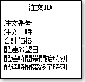
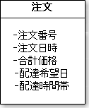

# 主キーを決める

## 手順

* 概念モデルを観ながらそのまま論理ＥＲ図のテーブルにする
    * 概念モデルのそれぞれの概念を論理ＥＲ図のテーブルとして作成
    * ＥＲ図作成ツールによっては、テーブルをエンティティと呼ぶ
    * 概念モデルから概念の属性も論理ＥＲ図のテーブルに追加
            
## 例

* 概念モデルに注文という概念があるとする
* 概念モデルを観ながらそのまま論理ＥＲ図のテーブルにする
    * 概念モデルの概念と同じ名前をテーブルに付ける
        * 論理ＥＲ図の表記は、日本語のままでOK
    * 注文番号などの属性も、そのままテーブルに追加
    

### 時間帯を開始と終了に分割

* 配達時間帯開始時刻と配達時間帯終了時刻のように、2つのカラムに分けて定義
    * 時間帯といった時間の開始と終了の範囲を表すような型が、DB製品に存在しない

### 主キーを決定

* 候補キーは注文番号
    * 注文番号は、システムが採番した業務上の注文を一意に識別するための番号
        * 注文番号は、顧客である会員にも通知される
        * 画面で注文照会する時に表示される
        * 実際に注文商品を納品する時にも納品書に印字される
* 主キーは、一度採番されると二度と変えられない
    * 注文番号は変更されることがないだろうか

#### 主キーの付け方

* 人工キー
    * Artificial Key
    * シーケンスなどの連番をシステムが自動的に採番して主キーとするもの
    * 欠点: 連番によるセキュリティ問題
        * 自然キーではデータベースで一意制約を保障できるが、人工キーではプログラムで保障する必要がある
        * 人工キーは連番になることが多いため、システム外の利用者や外部システムには公開しないようにすべき
            * 思わぬセキュリティの問題になる可能性がある
    * 長所: O/Rマッピングに相性が良い
        * キーを表すクラスはIntegerのように最初からプログラミング言語に組み込まれているものを使用可能
* 自然キー
    * Natural Key
    * 注文の注文番号のように、実際にそのテーブルに存在するカラムを組み合わせて主キーとするもの
    * 欠点: 変更があった場合に問題が生じる
        * 主キーという変更できないものに、業務やドメインに依存するカラムを使用すると、業務やドメインの変化が致命的な問題になる
        * 注文番号を主キーにすると、注文番号の形式が変更になった場合や、同じ注文でも注文番号を変更するようなビジネスルールがあった場合に問題になる
        * 主キーを1つのクラスとして扱うには、新しくクラスを定義する必要がある
    
ここでは、注文テーブルに人工キーによる主キーとして注文ＩＤを定義

