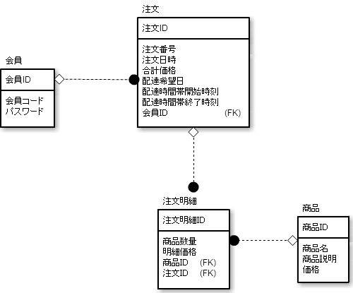

# 関連を外部キーにする

* 概念モデルの概念の間には関連がある

## 例

* 概念モデルには、注文と会員、注文と注文明細、注文明細と商品の間に関連がある
* 概念モデルの概念間の関連は、論理ＥＲ図の外部キーとして表現される

## 関連を表すＥＲ図

* 外部キーでは、参照先のテーブルの主キーを持る
* 注文テーブルからは会員ＩＤを持つ
    * 逆に、注文明細には注文ＩＤを外部キーとして持たれる
    * 主キーは、その行のアドレスを指す
        * 外部キーを持つことで相手を参照可能
        

