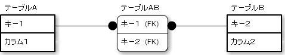

# 多対多の関連を関連テーブルにする

* 概念モデルでは、概念モデルの関連は1対多が望ましい
    * リレーショナルデータベースでは、多対多の関連は関連テーブルを作成して実現する
    * 関連テーブル: 2つの関連付けたいテーブルの間にあり、両方のテーブルの主キーをすべて持つテーブル
    

## 関連テーブル

* 例: テーブルＡとテーブルＢがあり、それらは多対多で関連している場合
    * リレーショナルデータベースでは、両方の主キーをすべて持つ`テーブルAB`を作成し、関連テーブルとする
    * これで多対多を実現可能

