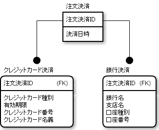

# 抽象クラスと具象クラスごとにテーブルを作る

* テーブル間のリレーションで置き換える方法
    * クラスごとにテーブルを作成するため、概念モデルを素直に表現でき、正規化が十分に行われる
* この方法では、具象クラスの数が増えたり、具象クラスが変更された場合でも、テーブルの変更が容易
    * この方法はＳＥＬＥＣＴするのに具象クラスと抽象クラスにあたるテーブルをＪＯＩＮして取得するため
* その一方で、パフォーマンスに若干の問題がある

