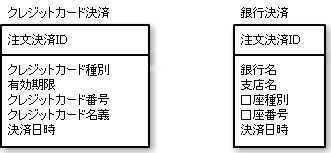

# 具象クラスごとにテーブルを作る

* 継承の考え方を捨て、`具象クラスごとに抽象クラスのデータを含めてテーブルを作る方法`
    * 1つの具象クラスが1つのテーブルに対応付けられていため、非常に簡単
    * 欠点
        * ポリモーフィズムを表現不可
        * たとえば、抽象クラスでデータや何らかの関連を持っていたとしても、この方法では各テーブルに分散されて配置されてしまう
        
