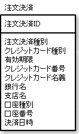

# クラス階層ごとに汎用テーブルを作りさらに型を表すカラムを用意する

* 継承のクラス階層を1つのテーブルで表現する方法
    * ポリモーフィズムも表現可能
    * パフォーマンスにも問題ない
    * 欠点
        * 後から具象クラスを追加することは少し難しくなる
        * また、具象クラスの数が多いとカラムが多くなり、複雑になる
        * また、具象クラスのカラムはNULL許可にしなければない
    * この方法では、どの具象クラスをテーブルのレコードが表すのかを表現するために、種別のカラムが必要になる
        * 下図の注文決済種別がそのカラム

