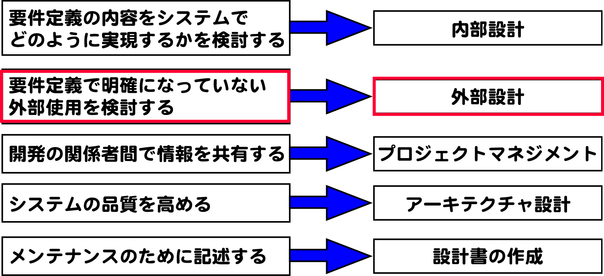

# 外部設計

外部設計では**入力と出力**を決める

# 概要

* システムとその利用者や他システムとのやりとりを決める
* 入出力を決める
* DB論理設計によって、データがどのように格納されるかも、大枠で決める

## 目次

* [概要](00_about)
* 主な外部使用の対象
    * 画面
    * [外部システムI/F設計](02)
    * [コマンド/バッチ設計](03)
    * [DBの論理設計](04_db)

## example

## 前提

* 要件は確定している
    * [今回の要件](https://github.com/aki-creatist/phases/tree/master/ph_02/05#example)
    * つまりCRUDを意識しながら機能一覧を書き上げるとコントローラの物理設計までできたことになる
    
## 機能名とコントローラ名は対にする

* FWではCRUDをセットにした`機能`の部分が`コントローラ`になる

### 機能一覧を作成

* フレームワークでは`CRUD`を１セットとして扱うことでデータのライフサイクルの生合成を保つ
    * Create-Read-Update-Deleteの頭文字をとったもので、以下の一連の流れを表す
        * あるデータの`登録`, `読み込み`, `更新`, `削除`
    * 設計後にそのデータの整合性について、兼さん的にチェックする際などによく使う
    * 機能忘れや不具合を未然に防ぐ
        * 例: `機能一覧`に`登録処理`と`検索処理`だけを書いて、`削除処理`を忘れていたetc
    * 多くのFWではこのCURDに`I`(一覧表示) を加えたものを`機能の基本セット`と位置付けている
        * 例: CakePHP

処理の種類

* 以下を１セットとして最低限の一機能とし、必要に応じて処理を追加することで機能を実現する
    * 一覧表示処理(index)
    * １件表示処理(view)
    * 登録処理(add)
    * 変更処理(edit)
    * 削除処理(delete)

## 会議室予約システムの機能一覧

### 会議管理機能 Meetings

| 機能名 | 処理名 | 英語名 |
|:----|:----|:----|
| 一覧表示処理(予約一覧) | index |
| １件表示処理(予約内容表示) | view |
| 登録処理(予約登録) | add |
| 変更処理(予約内容変更) | edit |
| 削除処理(予約取り消し) | delete |

### 会議室管理機能 MeetingRooms

| 機能名 | 処理名 | 英語名 |
|:----|:----|:----|
| 一覧表示処理(予約一覧) | index |
| １件表示処理(予約内容表示) | view |
| 登録処理(予約登録) | add |
| 変更処理(予約内容変更) | edit |
| 削除処理(予約取り消し) | delete |

### メンバー管理機能 Members

| 機能名 | 処理名 | 英語名 |
|:----|:----|:----|
| 一覧表示処理(予約一覧) | index |
| １件表示処理(予約内容表示) | view |
| 登録処理(予約登録) | add |
| 変更処理(予約内容変更) | edit |
| 削除処理(予約取り消し) | delete |

* これにリマインドメールの送信処理(send_remind_mail)などを追加などを臨機応変に対応

### モデリング

#### ①対象となるオブジェクトを洗い出す

| オブジェクト名 | 管理対象 | 管理単位 |
|:----|:----|:----|
| 会議室(MeetingRoom) | 部屋の情報 | 部屋の単位 |
| 会議(Meeting) | 会議の情報 | 開催されるごと |
| メンバー(Member) | 出席する可能性のある人 | 人単位 |

* このオブジェクト単位に`Modelクラス`と`DBのテーブル`を作る
* 特別な理由がない限りはオブジェクト(モデル)名とコントローラは対になるように設計する
* オブジェクト(モデル)が『会議室』であれば、コントローラは`会議室管理機能`となる
* オブジェクトの英語名(モデル名)はキャメルケースの単数形

#### ②オブジェクト同士を関連づける

* 洗い出したオブジェクトの関連づけを行う
* 関連づけを行う際には、多重度を設定する

* １回の会議で使用する会議室は１つだけで、会議の予定を作成した時点で会議室の予約を入れるものとする
    * 会議に対して会議室は一つ
* １つの会議室には日時が異なる複数の会議が存在し、システムの初期状態には会議の予約が全く入っていない状態がありうる
    * 会議室に対して会議は0〜n個
* １回の会議には複数人が出席するが、会議を予約した段階で出席者が誰も決まっていない仮登録を認めるものとする
    * 会議に対してメンバーは0〜n人
* １人のメンバーは複数の会議に出席するが、初期登録状態にはどの会議にも出席予定がない状態がありうる
    * メンバーに対して会議は0〜n個

#### ③関連図を物理モデルに書き換える

* `関連図`を`物理モデル`書き換える
    * `オブジェクトの名前`を`Modelクラス名(英語名)`に書き換える
    * `n:n`の関係で繋がっているオブジェクト同士を、関連モデル(中間テーブル)を介して連携させる
        * 実際のDBで使うときと同様

* 関連モデルの名前は、関連する２つのモデルの名前を連結する
    * どちらのモデル名を前にするかは、アルファベット順に並べて連結する
* 関連モデルの２つのモデル名は、１つ目を複数形、２つ目を単数形にする
* 関連モデル関係の不具合は、このルールが疎かになっていることが多い

### ④オブジェクトで管理する項目を洗い出す

* 項目名はスネークケース
* 主キーの名前は`id`
* 外部キーの名前は`連携するモデル名(スネークケース)`+`_id`

