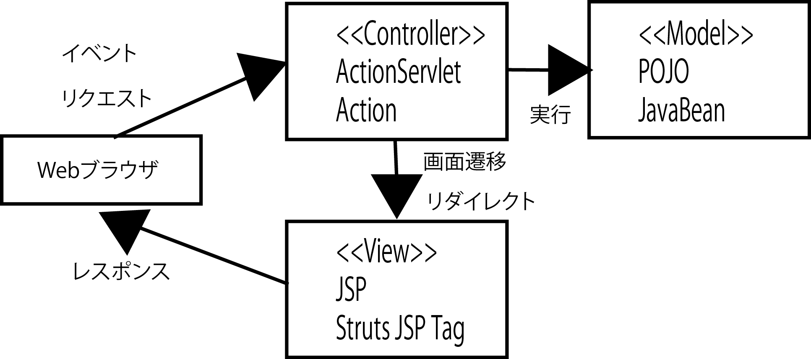

# Struts

画面設計で作成した画面遷移図、画面モックアップ、画面項目定義書をもとに、
画面のプログラム設計を行う

* オープンソースフレームワーク
    * フレームワークを使用せずにWebシステムを開発することはほぼ皆無
* MVCモデルに沿ったWebアプリケーションのソフトウェアアーキテクチャの１つ
    * `MVC`: 元来プログラミング言語のSmalltalkで使われていた手法
    * 現在の多くのGUIアプリケーションに影響を与えている
* GUIアプリケーション処理の役割を大きく分けて考えるのが特徴
    * Model
    * View
    * Controllerに

## Model

* ビジネスロジックとエンティティを合わせたもの

### ビジネスロジックとエンティティの関係

* エンティティ
    * DBのデータをオブジェクトで表現したもの
* ビジネスロジックとエンティティを合わせて`ドメイン`と呼ぶこともある

## View

* GUIの画面のこと
* Webでは、JSPやHTML、あるいはHTMLを表示するWebブラウザがView
    * ViewではModelの情報を表示する

## Controller

* ModelとVeiwを制御する
* 画面からのイベント(リクエスト)を適切なModelに仲介し、Modelの結果をViewに表示

## StrutsにおけるMVC

* Strutsが主に機能を提供するのはControllerとView
* Modelについてはほとんど機能を提供していない
* Strutsも、Servlet及びJSPの機能を使用
* ActionServletは、Servletクラスを継承している
* Struts JSP Tagは、Strutsが提供するJSPカスタムタグ

## Strutsで実装するもの

* 画面遷移XMLファイル(Struts-config.xml)
    * 画面遷移図からほとんどそのまま記述すれば良い
    * プログラム設計段階で行うことはほとんどない
* Actionのサブクラス
* JSPファイル
    * 実装時にコーディングすれば済む
* バリデーションXMLファイル(validation.xml)
    * 画面入力チェック仕様からそのまま記述すれば良い
