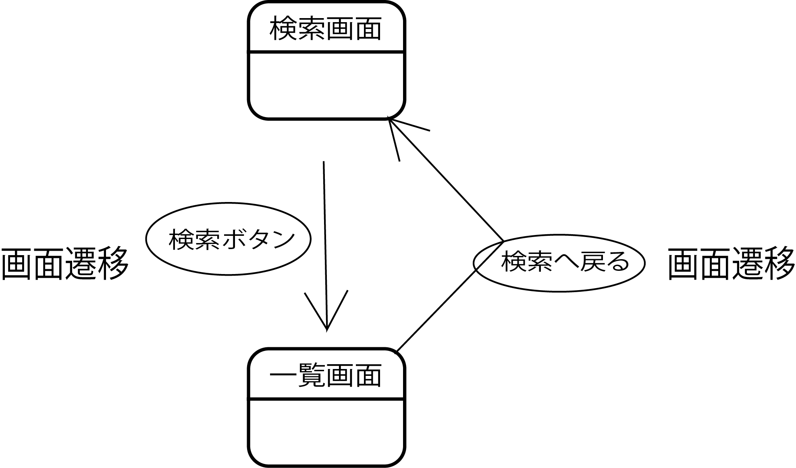

# 画面遷移図からのActionの抽出

* 画面遷移図からActionをすべて洗い出す
    * 画面遷移図でリンクかフォームになっている画面遷移は、Actionが呼び出されるか、静的なHTMLなどへの画面遷移
* 洗い出したActionは、`Action一覧`にまとめる

## Action抽出の例

図からActionを導き出す

* 画面遷移は２つ
    * 検索ボタンによる検索画面から一覧画面への遷移
        * 普通に考えればボタンとフォームで実現される
        * 検索条件を受け取り、検索した結果を一覧で返すActionが一つ導出される
    * 戻るリンクによる一覧画面から検索画面への遷移
        * 普通に考えればリンクで実現される
        * 検索画面を表示するActionが導出される

