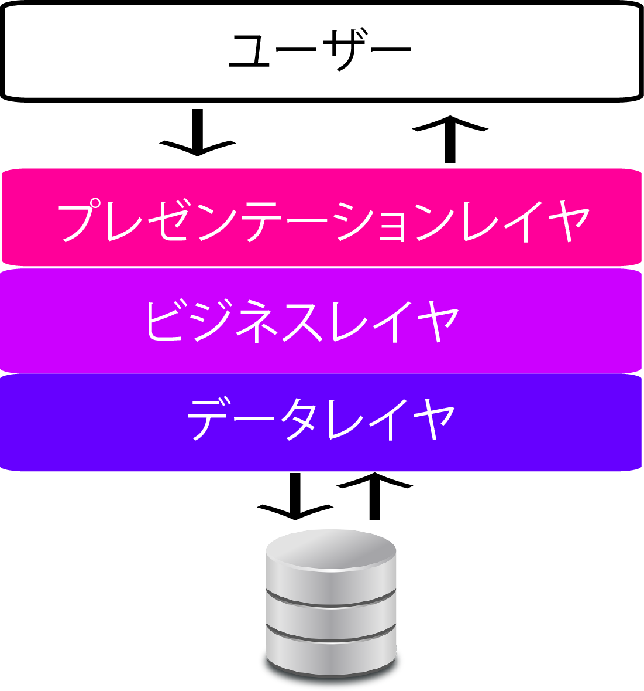
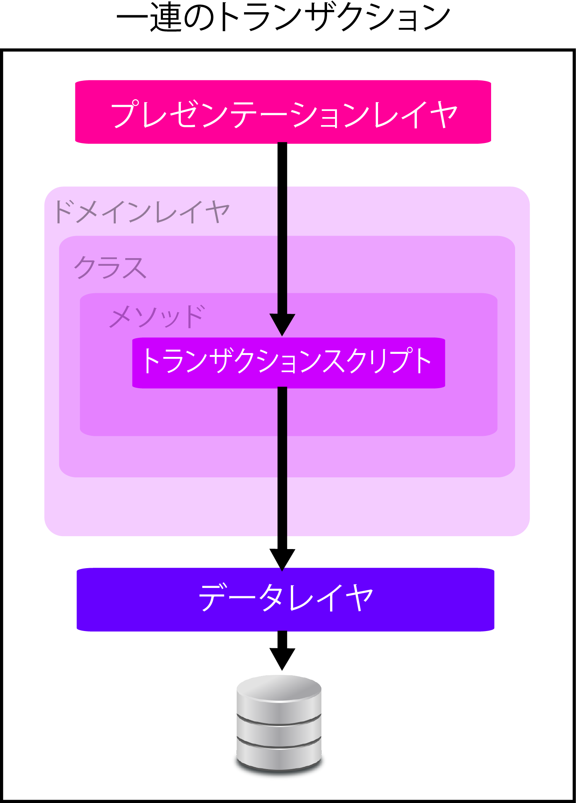

# 三層のアーキテクチャモデル

## プレゼンテーションレイヤ層

* システム操作するユーザに対してのユーザへのインターフェイスを提供する

## ビジネスレイヤ層

* プレゼンテーションレイヤからデータなどが渡され，業務処理を実行する
* サービスインターフェイスを設計する
    * プレゼンテーションからのデータ授受をシンプルにかつ柔軟にするため
* ビジネスレイヤでは業務処理を実行するため以下の３つが配置される
    * ビジネスワークフロー
        * ジネスエンティティをどのビジネスコンポーネントへ渡すか，ビジネスコンポーネントの処理の順番など，調整，実行を行う
    * ビジネスコンポーネント
        * 業務に依存した業務ロジックを作り込むコンポーネント
    * ビジネスエンティティ
        * サービスインターフェイスから渡されたデータやデータレイヤから来たデータをビジネスレイヤで扱えるデータ
        * つまりエンティティとして表現するために使用される
* サービスインターフェイスを経由してビジネスワークフローやビジネスコンポーネント，ビジネスエンティティへと処理は渡される

## データレイヤ層

* データソースやサービスとのデータやり取りや接続の手順，管理，制御を行う
    * この階層にはデータアクセスロジックコンポーネントやサービスエージェントが含まれる
        * データアクセスロジックコンポーネントは以下を行う
            * データソースとの接続の手順
            * データのやり取り
            * 接続資源の管理
        * この際，接続するデータソースはDBやファイル
        * 接続先によって接続手順は異なる
        * これらの煩わしさをビジネスレイヤに意識させないようにデータレイヤに隠ぺいする
        * サービスエージェントもデータアクセスロジックコンポーネントと同様

* ビジネスアプリケーションは、一連のトランザクションとして考えることができる
    * トランザクションには、データの単純な表示・登録や、ビジネスロジックが含まれている
* トランザクションスクリプトは、ビジネスロジックを１つのメソッド（プロシージャ）にまとめて、データベースを直接ないし薄いラッパーを介して呼び出す
* 「トランザクション」という言葉を使用しているのは、ほとんどの場合、データベーストランザクションごとに１つのトランザクションスクリプトを使用しているから
* `スクリプト`という言葉は、「スクリプト言語」のことではなく、「コード片」を意味している
