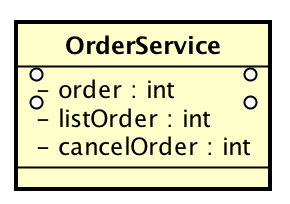
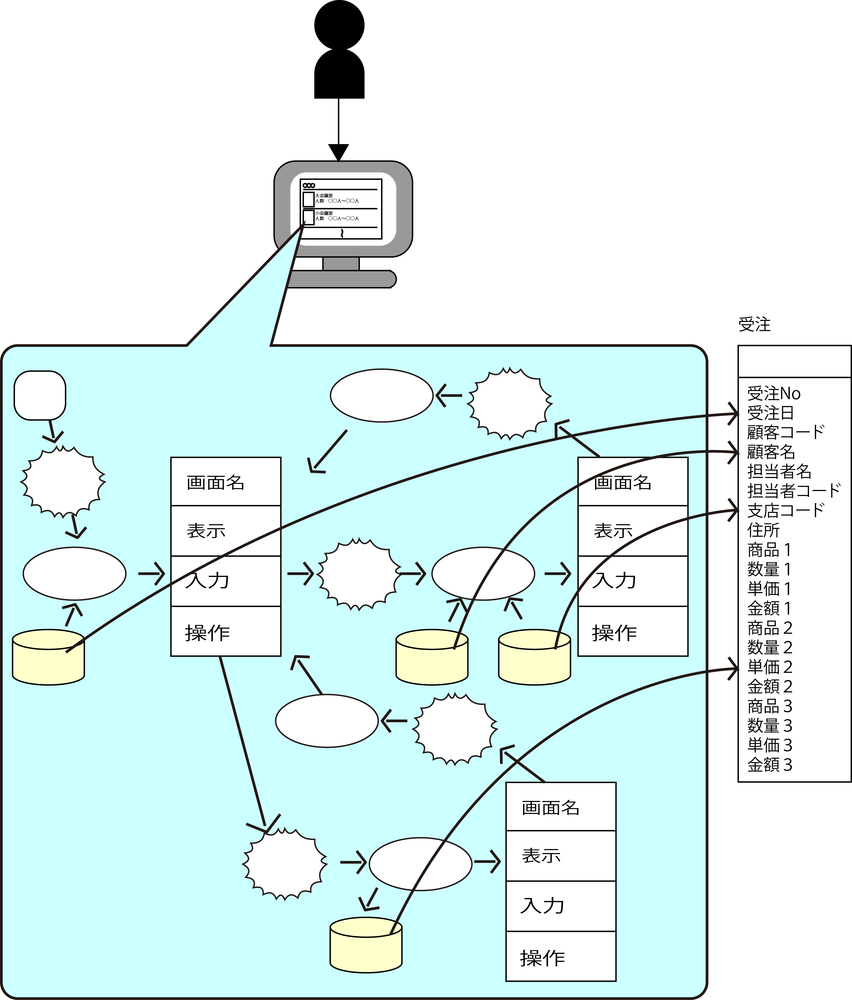

# TransactionScriptパターン

## 概要

ビジネスロジックをServiceクラスのメソッドにするという手法

ビジネスロジックをメソッドにして集め、属性などの状態は持たせない

## ポイント

* ドメインの情報がエンティティとTransactionScriptに分散される
* ビジネスロジックをメソッドにして集め、属性などの状態は持たせない
* 特別なインターフェイスやソーパークラスを実装する必要がない
* ビジネスロジックの処理を共通化するように設計するのは困難
* エンティティに関連したポリもーFISMは実現が不可

## Serviceクラス

* 何らかの適当な業務単位に作成されるクラス
    * ユースケース単位に作成しても構わない
* ビジネスロジックのメソッドを複数持つ

例: 注文関連のビジネスロジックを提供するOrderService

## TransactionScriptの特徴

* 処理とデータを別々に扱うという意味では従来の手続き型に近いもの
    * クラスは処理とデータをひとまとめにしたものなので、これはオブジェクト指向とは異なる考え方
* ドメインの情報がエンティティTransactionScriptに分散される
    * DBに永続化するオブジェクト
* カプセル化を行わない
    * 設計が用意
    * 代わりにカプセル化のメリットである仕様変更に対する強さを失う
        * オブジェクト指向では、データと処理を一つのクラスで管理してカプセル化するのが普通
* 特別なインターフェイスやスーパークラスを実装する必要がない

## 採用する理由

* 設計が簡単
* どのようにエンティティを処理するかだけに着目すれば設計可能
* TransactionScriptのアプローチは、手続き型言語のアプローチに似ている

エンティティは名詞・動詞法を用いて抜き出した『器』(イベント系とリソース系)

## 処理の共通化は諦める

* TransactionScriptでは、エンティティに関連したポリモーフィズムは実現が不可
* ビジネスロジックの処理を共通化するように設計するのは困難
    * 仮に処理を共通部品として切り出せたとしてもその共通部品を使うように設計すると、結局は難易度が高くなる
    * その共通部品を使用できたとしても、エンティティと絡ませてカプセル化をするわけではない
