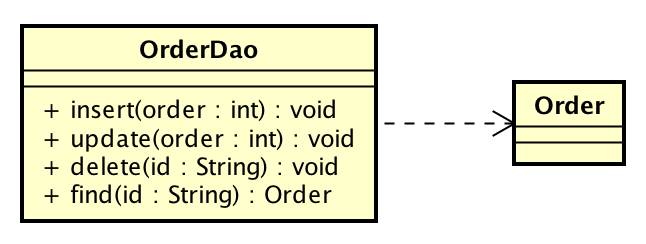

# DAOパターンを使う

* Data Access Object
    * 永続化処理を永続化されるオブジェクトから分離しDAOクラスに隠蔽するためのパターン

* DAOインターフェイスを定義し、DAO実装クラスを分離することで、DAOの実装を切り替え可能
    * 複数のO/Rマッピングツールを切り替え
    * 他の`永続化`先に変更etc,,
* DAOパターンを使うことで、永続化するオブジェクトをPOJOとして扱える
    * このPOJOのオブジェクトはDBに永続化されるオブジェクト
        * 概念モデルに登場するオブジェクトが最も相応しい
        * 概念モデルをもとに作成される、DBに永続化するオブジェクトを`エンティティ`(Entity)と呼ぶ
        * 業務システムであれば、業務に関するオブジェクトがエンティティになる
