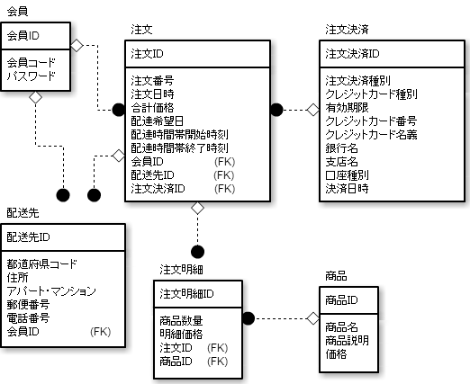

# エンティティクラス図の作成

## 概要

## ゴール

概念モデルをもとにしてエンティティのクラス図を作成する

## 手順

* 開発プロジェクトの命名規約に従って、概念モデルのクラス図からクラス名や属性名を英語名にする
* 概念モデルの日本語の属性名を英語の属性名にする
* アクセサーメソッドを追加
    * `アクセサーメソッド`: クラスの属性への`getter()`と`setter()`
* クラス間の関連に方向(矢印)を付ける

## 留意点

* 概念モデル
    * 関連の方向性が重要ではなかったためクラス間の関連は、ほとんどが矢印にはなっていない
* エンティティクラス図
    * 関連の方向性が重要
        * 関連の方向性は、クラスを実装する時に、どちらのクラスが相手先のオブジェクトへの参照を持っているか
        * エンティティの関連の矢印を決めるには、`プログラムがどのエンティティを中心に操作するのか`を考える
    * エンティティクラス図で関連を矢印にし、多重度が1つの`コレクション`を属性で持つことになる

## 例: 注文と注文明細

* OrderとOrderDetailが`ヘッダーと明細の関係`になっている場合
    * ヘッダーであるOrderを先に呼び出し、OrderからOrderDetailを呼び出す
    * この場合は、OrderからOrderDetailへの矢印になる

