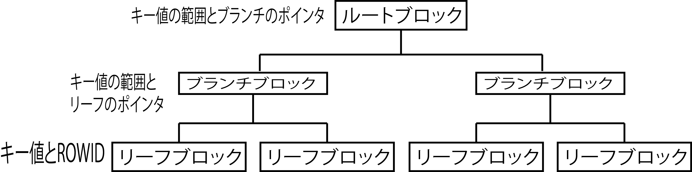

# Bツリーインデックス

* 値の種類が多いデータに適している
    * 性別といった列には男女の2つの値しかない
        * インデックスを使っても全体の半分までしか絞れない
    * 検索する条件(WHERE)の列の値が偏っている場合にも効果は出ない
        * 検索する列の値の大半が同じ値だとしたら、それらは同じリーフブロックに所属するので、インデックスの効果は出ない

検索するキー値をツリー構造で管理する

* キー値が分散している場合に効果を発揮する
    * 同じキー値の範囲に値が偏って分布する場合には、インデックスの効果は出ない
    * 結局は同じリーフブロックの中だけで検索することになるため

ツリー構造は上からルート、ブランチ、リーフの3段階

* ルート
    * 下位ブロックへのポインタが格納されている
    * `キー値の範囲`が定義されており、その範囲ごとに対応する`ブランチブロック`が定義されている
* ブランチ
    * 下位ブロックへのポインタが格納されている
    * `キー値の範囲`が定義されており、その範囲ごとに対応する`リーフブロック`が定義されている
* リーフ
    * キー値に対応するROWIDが格納されている
        * ROWID: 行を一意に特定するID

* 検索する時はルートブロックから始める
    * ルートブロックで検索するキー値からブランチブロックを決定
    * ブランチブロックでもキー値からリーフブロックを決定

## Bツリーインデックスの注意

* 検索する条件の列にインデックスが作成されていても、LIKEによる部分一致で検索を行う場合には、後方一致や中間一致ではインデックスを使用できない
* キー値の範囲によってブロックを辿ることで検索を行うが、後方一致や中間一致ではキー値の範囲を判断できない
* DB製品の組込み関数を使った場合にも、インデックスが適用されない
    * 組込み関数の結果の値でインデックスを作成しないため