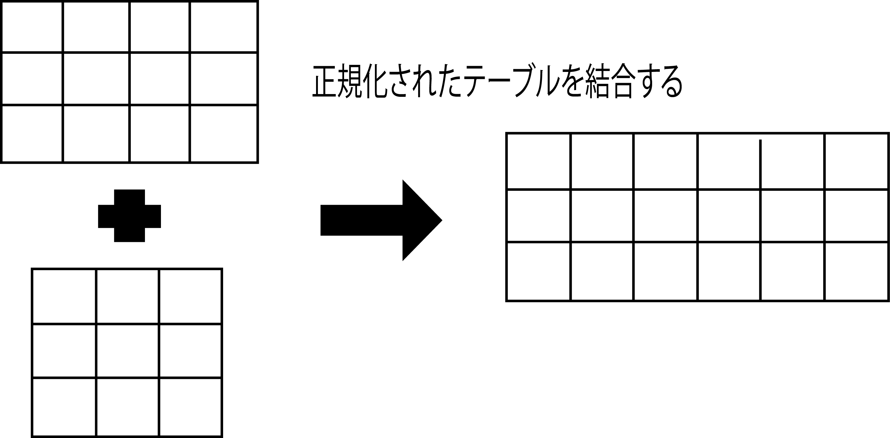

# インデックス

いくつかのルールに従って`ROWID`を素早く見つけるための仕組み

* [概要](00_about)
* [Oracleのインデックスのルール](01_rule)

#### 正規化されたデータベースの結合

* 照会する時に結合する必要がなくなり、パフォーマンスが向上する
    * ただし、正規化を崩すと、当然ながらデータ構造が冗長になる
        * 同じデータを重複して持たざるを得なくなる
        * 重複したデータは挿入、更新、削除などで重複したデータのすべてを同じく更新するように注意する必要がある
        * 場合によっては、照会のパフォーマンスは向上しても、挿入、更新、削除のパフォーマンスが低下する

