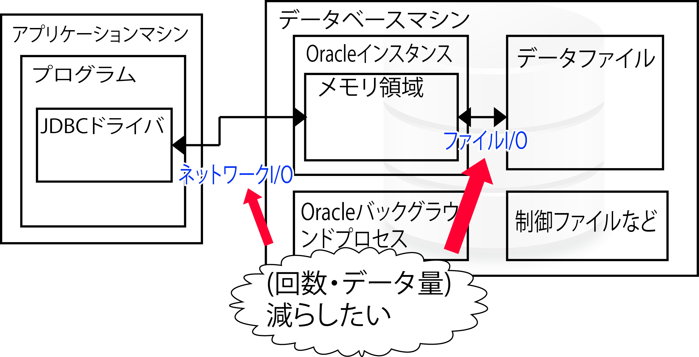

# DBパフォーマンス設計

## 概要

* [SQLの標準の策定](01)
* [ディスクI/Oを減らす](02)
    * ディスクI/Oの発生を減らすアプリケーション設計
    * ディスクI/Oの発生を減らすDBを設計
* [インデックスを作成する](03_index)

## DBのパフォーマンスで重要な点

* I/Oを減らす
    * 回数を減らす
        * DBサーバーにおけるファイルI/Oを減らす方法
            * SQLをOracleインスタンスのメモリ領域にキャッシュさせる方法
        * クライアントからDBサーバーへのネットワークI/Oを減らす方法
    * 1回のI/Oで行うデータ量を減らす
* インデックスでデータを見つけやすくする
* 結合を簡単にできるようにする
* 処理をまとめて行う
    * CRUD処理は、まとめて行うことでパフォーマンスが向上する
        * 例: JDBCの`Statement#executeBatch()`
* 本来、特定のデータベース製品の内部実装などは開発者が知らなくてもよい
    * DB製品に依存したアプリケーションの開発は望ましくない
* 現状、十分なパフォーマンスを発揮するには、ある程度のパフォーマンスチューニングが必要
    * DB製品の実装も知る必要がある
    

