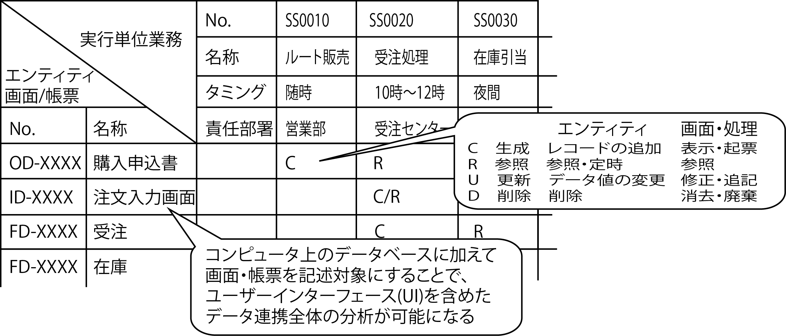
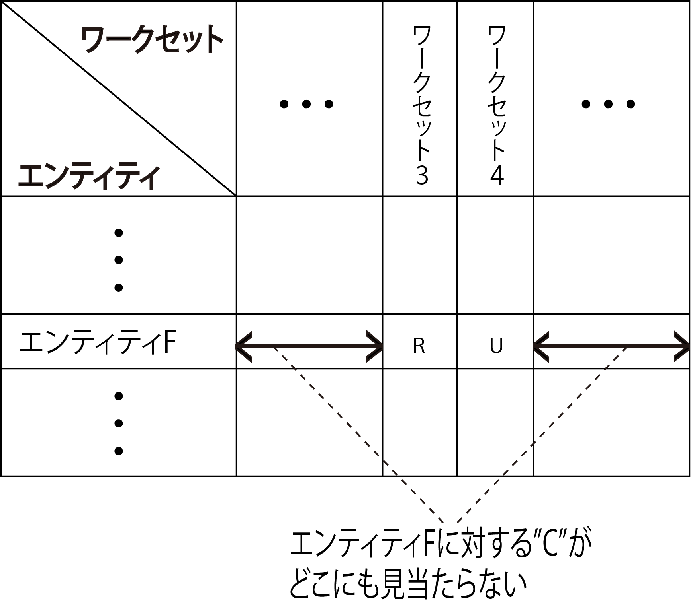
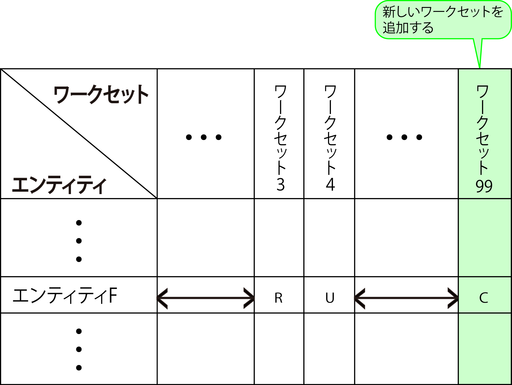
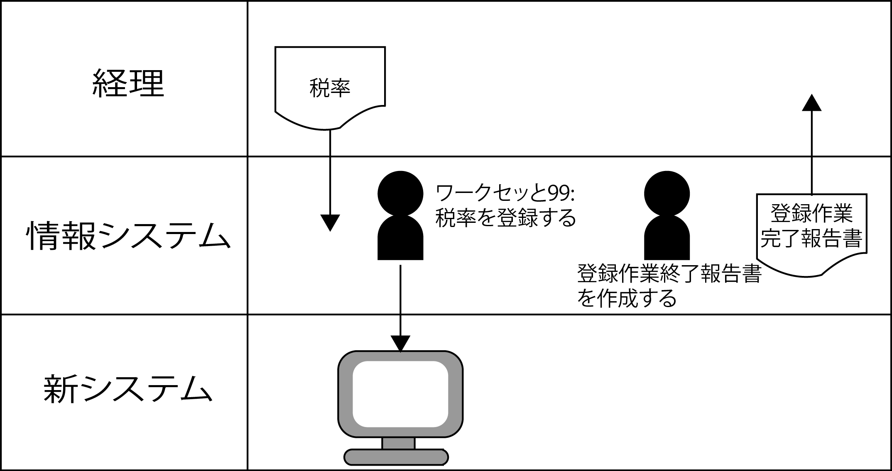

# CRUD設計/分析

## 概要

CRUD分析・設計では、**ビジネスロジックがどのDBに対してCRUDを行うか**を分析し、設計

* CRUD
    * DBへの基本的な操作を表したもの
        * C: 作成 Create
        * R: 読込 Read
        * U: 更新 Update
        * D: 削除 Delete

* テーブルを操作するビジネスロジックが明確になる
    * テーブルの列をオブジェクトとして捉えた時のライフサイクルが正しいかがわかる
        * ビジネスロジックＢでテーブルＡを更新(UPDATE)する場合
        * 先に実行されるであろう他のビジネスロジックでテーブルＡが作成（CREATE）されている必要がある

## 前提条件

* 以下が処理済みであること
    * プログラム設計
        * 画面設計プログラム設計
        * ビジネスロジックプログラム設計
        * データベースプログラム設計
    * データベース物理設計

## ゴール

画面もしくはビジネスロジックにおいて、詳細に**どのようにDBを更新するのか**を明確にする

### CRUDマトリクスの活用

成果物の品質をコントロールするためのツール

* 組織ミッションとアクセス権テーブルの整合
    * 取り扱う単位もシステム全体ではなく、個々の画面やプログラムといった単位に分割されていく
    * 上流工程の締めくくりとして、全体の整合性を検証＆保証しておく



* データライフサイクルを表すCRUD
* CRUDは俗にデータライフサイクル(データの寿命)を示すものとされる

```text
DBに1件のレコードを記録するとして、
そのレコードは、まず最初にCreate(生成)して記録され、
それを必要に応じてReference(参照)やUpdate(更新)を行い、
最終的に不要になった時点でDrop/Delete(消去)するということ
この一連の流れがDLCすなわちデータライフサイクルと呼ばれる
```

## CRUDマトリックスによる検証

* CRUDマトリックスは、表の一方の軸に先ほどのDB設計に出てきたエンティティを並べる
* もう一方のお軸にワークセットを並べる
* その二軸の交点にC/R/U/Dのいずれかを記載
    * このワークセットは
    * このエンティティを
    * C/R/U/Dします、という一覧になる



* このCRUDマトリックスを作って不足のワークセットを検証する
* 具体的には、エンティティの１つずつに対して、R/U/DがあるにもかかわらずCがないものを探す
* エンティティは、あるワークセットで使用するために必要なのでDB設計に表れる

### ワークセットと行動シナリオの追加

* Cすなわち生成を行うためのワークセットを追加してやる必要がある



* ワークセットを追加すると、このワークセットに対する要件を定義してやる必要がある
* そうすると、「そもそもこの追加されたワークセットはどのようなシナリオに基づいてりようされるのか」ということになる
* 追加したワークセットを利用する行動シナリオをさらに追加する



* このあたりは、特にマスターメンテナンス系と呼ばれるところに多く発生する
    * 例: `消費税を計算する`というワークセットにおいて税率が必要になる
    * この税率は放っておくと勝手にDBに入るわけではない
        * 当然別途「税率を登録する」というワークセットが必要
        * ワークセットの利用者を想定するを(いつ誰が利用するのか)
            * 誰もが好き勝手に税率を変更すると困る
            * そのためその仕事をするための行動シナリオが定義する必要がある
        * 逆に言うと行動シナリオが定義されていなければ、利用者が想定できない
        * 行動シナリオをきちんと定義して、それを周知することが必要になる

#### 手順

* システム全体の整合性を保証するためには、組織とプロセスの設計に加えて、データベースとの整合性確認が必須
* プロセス設計とデータベース設計の整合性を検証するには、「CRUDマトリクス」（通称、クラッドマトリクス）を活用する
* 縦軸に「エンティティ・画面／帳票」、横軸に「実行単位業務」の一覧を展開し、各セルには次の記号を記述

#### 要素

* C：Create（生成）
* R：Refer（参照）
* U：Update（更新）
* D：Delete（削除）

#### 目的

* 各々の実行単位がアクセスすべきエンティティを明示する

#### 効果

* アクセスする必要のない、あるはしてはならないエンティティも明確になる
* これは見方を変えると、組織別のアクセス権限表にもなる
* CURDマトリクスはシステム全体の仕組みの品質を保証するための必須のツール
    * システム全体: DBにアクセスする組織やプログラムetc
* システム全体の整合性を保証するために必須の設計図書

