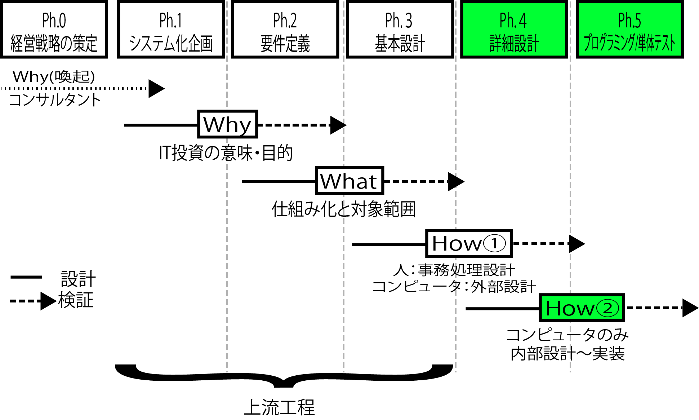

# 内部設計

内部設計では**入力と出力の間**で行う内部処理を設計する

## TODO

* [具体的なソフトウェア内部の設計](01_program)
* [DB物理設計](02_db)
* [CRUD設計](03_crud)

## example

* 処理名とアクション名は対にする
* FWのコントローラは、リクエストを操作するための`アクション`と呼ばれるいくつかのメソッドを提供する
* CRUDに沿って書き出した処理を基本的なアクション名に対応させる
    * view、add、editなど
* コントローラ上の全ての publicメソッドはアクションとなり、URLからアクセス可能
    * アクションはリクエストを解釈してレスポンスを返す役割がある
* 英語機能名(コントローラ名)は複数形にする
* コントローラ名は英語機能名＋Controllerとなる
    * この機能名はキャメルケースの複数形
* アクション名(処理名)はスネークケース
    * 動作を表す名前にしておくと直感的に何をしているのか理解しやすい
        * 「URI」(コントローラ名+アクション名)にしたときに「何を(機能)+どうする(アクション)」という形式になるように

