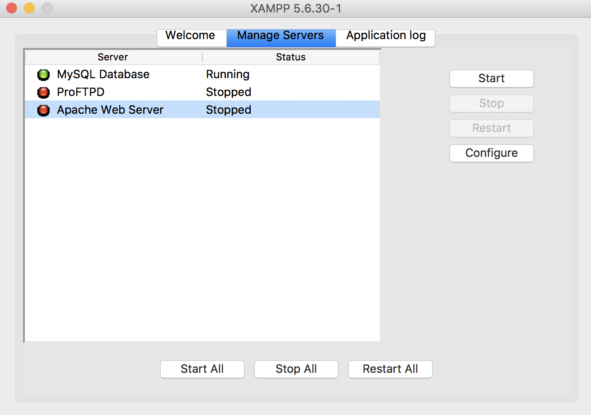

# Mac

* XAMPP Control Panelを起動して`[Manage Severs]`を選択
* 一番上に`[MySQL Database]`がある
    * 左のインジケータが緑だと起動中
    * インジケータが赤でstatusが`[Stopped]`だとMySQLサーバは停止中
        * `[MySQL Database]`を選択して右側の`[Start]`ボタンをクリック
            * 左側のインジケーターが赤から黄色になり、緑になると起動に成功

