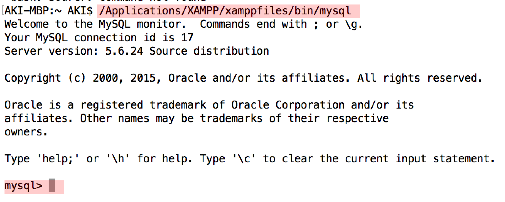

# 接続と切断

## MySQLへ接続する

* サーバに接続するにはクライアントソフトが必要
* MySQLサーバに接続するにもMySQLクライアントを利用する
* ここではMySQL CLI ツールを利用して接続する
    * コマンドライン・クライアントと呼ばれる
    
## 手順

* コマンドプロンプトまたはターミナルを起動してOS別にコマンドを入力
* Enterキーで実行
* MySQL CLIツールが起動する
* 接続すると`mysql>`プロンプトが表示され待機状態になる
    * これでMySQLサーバへ接続完了

### Windows</th>

* スタート画面のタイルが表示されていないところで右クリック
* 下部に表示された「アプリバー」から「すべてのアプリ」をクリック
* アプリ画面が表示されたら「コマンドプロンプト」を探してクリック

```bash
C:¥xampp¥mysql¥bin¥mysql
```

### Mac

* Launchpadの「その他」の中にある「ターミナル」アイコンをクリックしてターミナルを起動

```bash
/Applications/XAMPP/xamppfiles/bin/mysql
```

### Linux

* 実行する時はroot権限で操作する

```bash
/opt/lampp/bin/mysql
```

### 成功例

下図はMacのターミナル上での成功例



## MySQLサーバから切断する

* MySQLサーバから切断するには、「mysql>」プロンプトに以下のいずれかを入力
    * exit
    * quit
    * \q
    * ¥q
* Enterを押す

## その他の命令

* 以下のいずれかで表示kanou
    * `help`
    * `\h`
    * `¥h`
