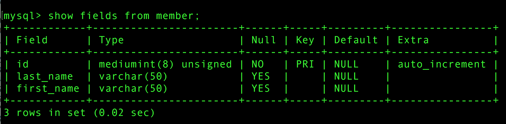

# テーブルを作成する

## 前提条件

MySQLの中に`sampledb`という名前のDBを作成してあること

## 概要

文字列や数値をデータとして格納するには、DBの中にテーブルと呼ばれるものを作成する必要がある

* [テーブルの意味](01)
* [CREATE TABLE文](02)

### DBを指定して接続する

下記のようにすると`USE`文を省略してすぐに目的のDBにアクセス可能

```bash
mysql -u ユーザ名 -p DB名
```

### テーブルを確認する

```sql
SHOW TABLES;
```

### テーブルの削除

* `DROP TABLE`文を実行すると指定したテーブルを削除可能

```sql
DROP TABLE テーブル名;
```

### テーブル構造を確認する

```sql
--対象テーブルに設定した構造が表示される
show fields from テーブル名;
```


