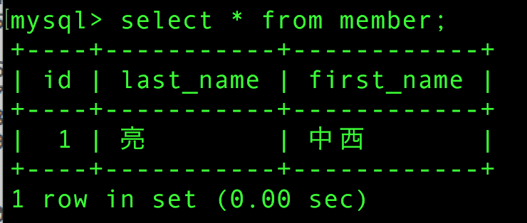
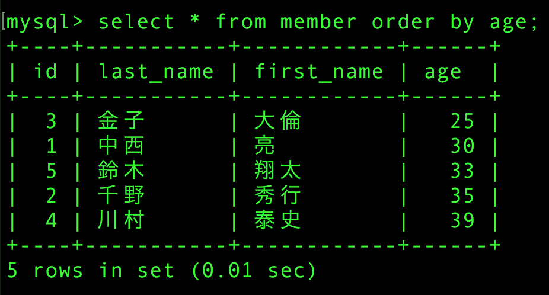

# データの検索

* テーブルに挿入したデータはSELECT文により検索して表示可能
    * 検索するデータを絞り込むには、条件文をWHEREで指定する

## SELECT文

* テーブルに挿入されたデータは`SELECT`文で検索する
* `*`を指定することで、テーブル内に設定されているカラムをすべて表示する
* `FROM`の後にテーブル名を記述して、最後は`;`で終わる

## 項目を全て検索する

* CLIクライアントを起動
* プロンプト`mysql>`が表示されたらSQLを実行する
* 入力したデータが表示される

```sql
SELECT * FROM members;
```

## データを準備する

* 条件検索用にデータを追加する
* `DROP TABLE`文ででテーブルと格納中のデータを削除
* 年齢を格納するカラムを追加する

```sql
DROP TABLE members;
CREATE TABLE members (
id         MEDIUMINT UNSIGNED NOT NULL AUTO_INCREMENT,
last_name  VARCHAR(50),
first_name VARCHAR(50),
age        TINYINT UNSIGNED,
PRIMARY KEY (id)
);
INSERT  INTO member (last_name, first_name, age) VALUES('中西','亮', 30);
INSERT  INTO member (last_name, first_name, age) VALUES('千野','秀行', 35);
INSERT  INTO member (last_name, first_name, age) VALUES('金子','大倫', 25);
INSERT  INTO member (last_name, first_name, age) VALUES('川村','泰史', 34);
INSERT  INTO member (last_name, first_name, age) VALUES('鈴木','翔太', 33);
```

## 条件を設定して検索する

### WHERE句

* 条件を設定して検索する
* 検索するデータの数を絞るには、`WHERE`句を使用する
* WHEREの後に条件を指定するための式を追加する

```sql
SELECT * FROM members WHERE 条件式;
```

年齢(age)が30を超えるデータのみを検索表示

```sql
SELECT * FROM members WHERE age > 30;
```



## データをソートする

* ソート: 並べ替え
    * ASC: v
    * DESC: 降順

```sql
SELECT * FROM MEMBER ORDER BY age;
```


