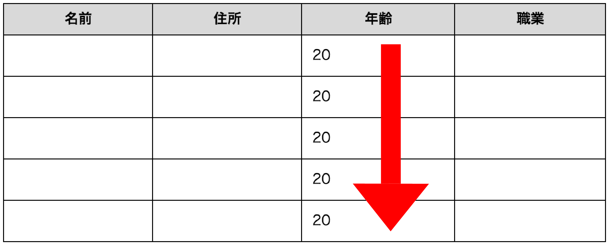
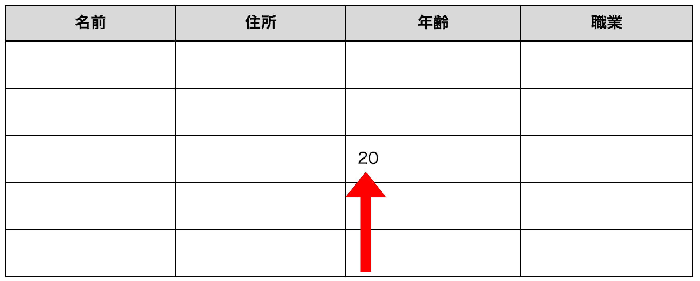
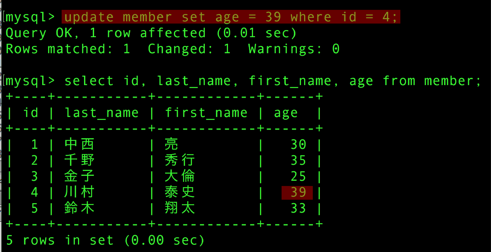

# データを更新

* UPDATE文で挿入したデータを新しいデータに更新する

## UPDATE文

* 更新にはUPDATE文を使用する
* UPDATE文は登録済みデータを指定した値に書き換える
* 対象カラムに格納されているデータを更新データで上書きする

```sql
--SETで指定されたカラム名に格納されている表内のすべてのデータを指定した値で更新
UPDATE テーブル名
SET カラム名 = "更新データ";
```

```sql
--年齢全てを 20 に変更
UPDATE テーブル名
SET 年齢 = 20;
```



### 条件なしの更新

* 目的のレコードだけを更新するには、WHERE句で条件を指定する



### 条件を指定した更新

#### データを確認する

* `SELECT *`とすると表に定義されているカラム全てが出力る
* 任意のカラムだけを出力するには`SELECT`に続けて表示したいカラム名を記述
* 複数ある場合は、`,`で追加可能

```sql
--事前にテーブルに登録されているデータを確認
SELECT id, last_name, first_name FROM members;
```

#### 更新する

* UPDATE文に`WHERE 条件式`を追加

```sql
--id 4番の「川村」さんの年齢「34」から「39」に変更
UPDATE members SET age = 20 WHERE id = 4;
```

