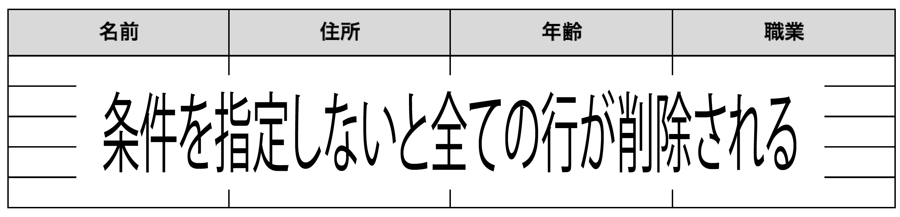
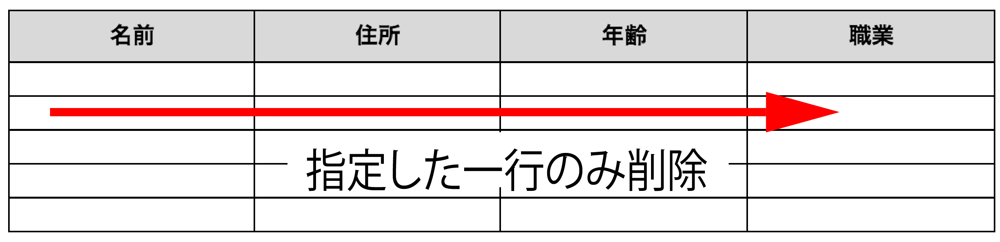
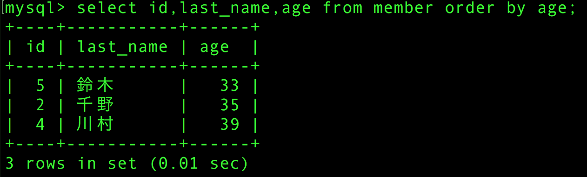
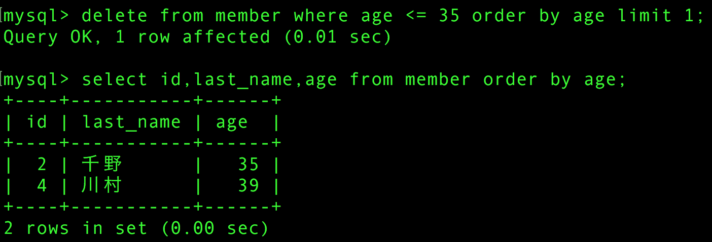

# データの削除

## DELETE文

* DELETE文は登録済みデータをレコード単位で(１件のデータ全て)削除可能

```sql
DELETE FROM テーブル名;
```

## 条件なしの削除

削除対象を指定しない場合、表内の全てのデータが削除される
    * 例:「DELETE FROM テーブルA;」とすると、テーブルAの中でデータは全て削除される



## 条件を指定した範囲のデータ削除

* WHERE句で条件を指定する



```sql
--確認したデータからageが「30」以下のレコードを全て削除
DELETE FROM member WHERE age <= 30;
```

## 削除を確認する

* ageが30以下のデータが削除されていたら成功



## 一件だけ削除する

* `LIMIT`を使用すると検索や削除などの時に処理を実行する件数を制限可能
* SELECT文の場合、`LIMIT 1`とすることで昇順で並べたデータの１件目だけを検索結果として取得可能
* 削除の場合も`LIMIT`を利用可能

１人分のレコードを削除するのも、DELETE文に「LIMIT 1」を追加するだけ

```sql
--例: 40際以下の人の中で一番年齢の低い人を削除する
DELETE FROM member WHERE age <= 35 ORDER BY age LIMIT 1;
```


