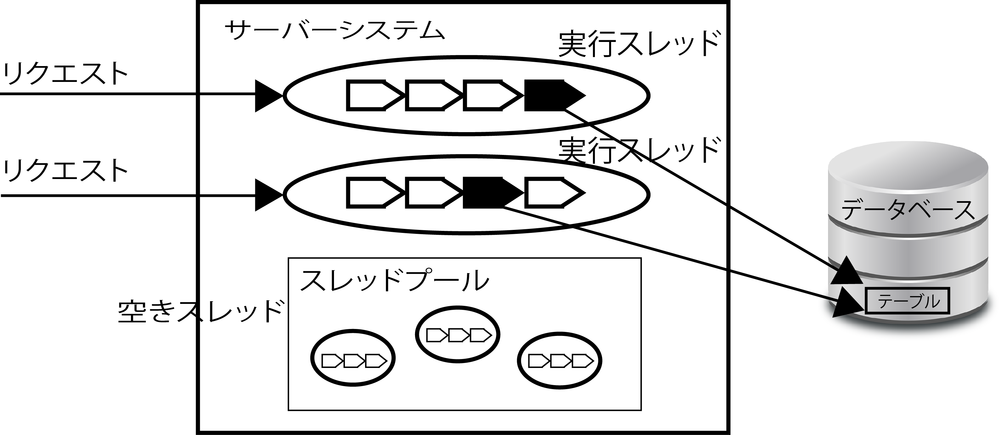

# スレッド

1つのプロセスが複数の処理を並行して行うための仕組み

* Webアプリケーションサーバーは、`スレッドプール`を搭載している
    * スレッドプールはいくつかのスレッドのインスタンスを保持している
    * リクエストが来るたびに空いているスレッドをリクエストに割り当ててくれる
* 実際にリクエストの処理を行うのは、この割り当てられたスレッド

* スレッドは特別な処理をしない限り、独立して実行され、並列して動いてる他の処理を意識せずに実行される
    * 特別な処理:
        * Javaのsynchronizedのような同期ブロックで処理を行うことや
        * スレッド間で同じオブジェクトのインスタンスを共有することetc

## 問題点

* マルチスレッドで処理を行わせたとしても、DBだけは複数の並列する処理が同期してしまう
* それぞれのスレッドの処理が違うテーブルを操作するのであれば、並列に処理される
* 同じDBの同じテーブルを操作する時に問題が起こる
    * コミットしていないデータは、他のスレッドのトランザクションからは参照できない
    * 仮に、同じテーブルのレコードを参照したとしても、更新前のデータが見えるはず

