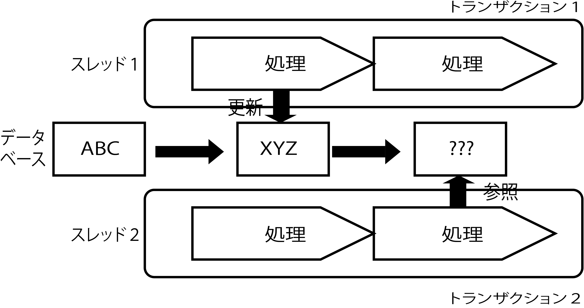

# ダーティーリード

コミットされていないデータを参照できること

* スレッド1と2がある
* それぞれ処理を行う
* DBにABCというデータがあり、各スレッドの処理からデータを操作する
* まず、スレッド１がトランザクションスコープ内でABCをXYZに更新
* トランザクション1がコミットする前に、トランザクション2が同じデータを参照したとする
* この時、参照できるデータの値
    * READ_UNCOMMITTED→XYZが参照可能
    * READ_COMMITTED→ABCが参照可能

