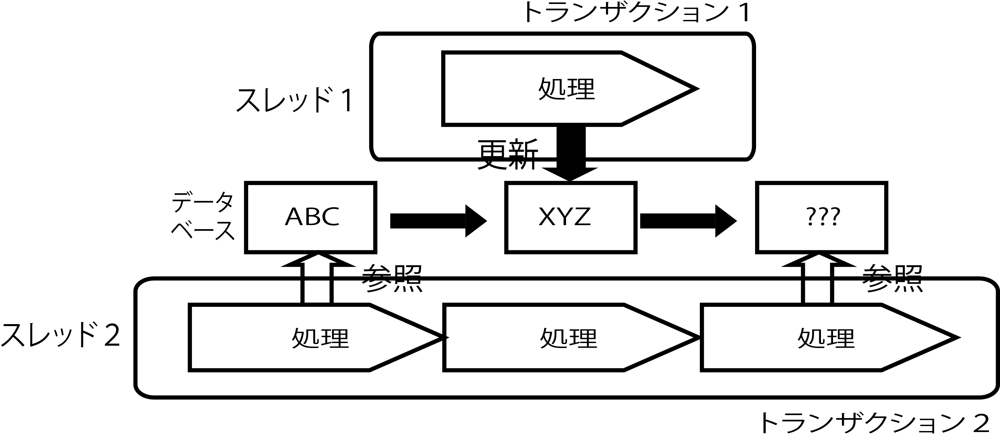

# ノンリピータブルリード

* スレッド2が同じトランザクションの中で、DBの同じデータを2回参照した場合
* 同時にスレッド１が同じデータを更新
    * トランザクション1がコミットされてから、トランザクション2がデータを参照している
* スレッド2の2回目の参照は下記
    * READ_COMMITTED: 2回目の参照ではXYZが参照可能
        * スレッド2では、同じトランザクションの中で同じデータを2回参照したにもかかわらず、2回の参照でABCとXYZというように異なる値になっている
        * これでは、トランザクションにおけるデータの整合性は保たれない
        * REPEATABTEREADにすることで2回の参照で同じABCを値として参照可能になる
    * REPEATABTEREAD: 2回目の参照ではABCを参照可能

