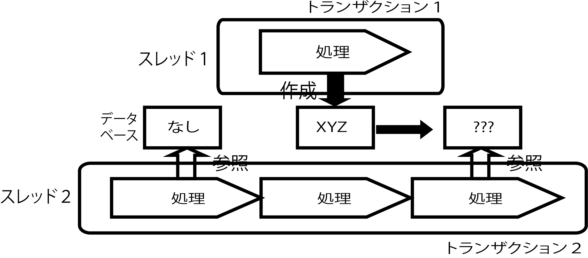

# ファントムリード

データ(行)を作成(INSERT)し、削除(DELETE)する場合に発生

* データを作成し、削除する場合
* 1回目に参照した時に存在しなかった行について
    * REPEATABLE_READで2回参照: 2回目の参照で存在する
        * トランザクションにおけるデータの整合性は保たれない
    * SEREIALIZABLE: 存在しなかったデータを参照できない
    
