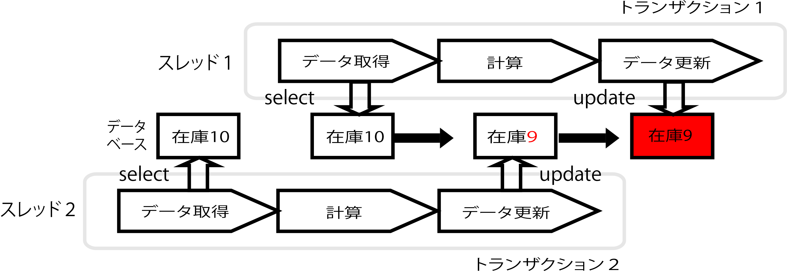

# DBロック

* 同じデータを更新する場合
    * データを他のトランザクションが更新することを制御する
    * そのための仕組みは`ロック`と呼ばれる
        * テーブルの行単位でロックを取得するものや、テーブル単位でロックを取得するものがある
        * 更新用のロックや参照用のロックなど様々
        * 最近のDB製品は、ロックの範囲を最小限にすることで処理待ちを最低限にしている
            * パフォーマンスの改善とデッドロックを回避
* よく使われるロックにSELECTの更新ロックの取得がある

## 例

* 商品の在庫データに対して更新を行いたい場合
* 在庫数を更新する手順
    * DBに格納されている現在の在庫数を取得(SELECT)
    * 取得した在庫数から購入数を減算
    * 減算した在庫数をDBに更新(UPDATE)する
* 在庫数の取得でSELECTを1回行って、計算した在庫数をDBにUPDATEする
* このSELECTからUPDATEまでに間に、他のトランザクションによって在庫数を更新されてしまうと不整合が発生する

### 不整合の発生




* トランザクションのアイソレーションレベルをSERIALIZABLEにしても、データの更新はできるので問題は発生する
* この問題を回避するにはロックを取得する
    * 最初のSELECTの時に更新ロックを取得する
    * 取得したロックは、トランザクションが終了する時に自動的に開放される
   
```sql
--ロックを取得
SELECT * FROM order FORUPDATE;
```
