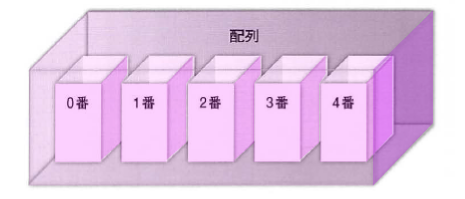
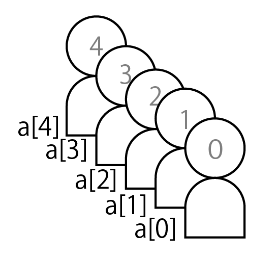

# 配列

* 変数に複数のデータを格納し**データを並べて操作する**には「配列」を使用する
* 一つ一つを要素と呼ぶ
* 変数と同じように、名前がつけらる

## 配列の作成

### 配列とは

* 「配列」は、複数の箱を持った変数と考えることができる
* 複数の箱を識別できるように、箱には順番に番号(インデックス)が付いている



* このような配列を利用することで、データとそのデータの順番を同時に格納可能
* 箱の順番は**0から**始まる
    * 1、2、3、4…とデータの数だけ続く


* 順番が大切な意味を持つ**会員名簿の一覧**を出力する時などに配列は威力を発揮する
* 配列に名前をつける
* 配列を使う場合には前もって宣言しなくてはならない
* 配列の名前は変数と同じ規則が適用される
    * 見た目だけでは配列なのか変数なのかわからない
* 配列名が`a`であれば、各要素の名前も`a`



* 要素の宣言は初期値の有無によって異なる
* Javaの場合、要素の型は配列名と同じ型を使って要素数は整数で指定する

```text
// PHP と javascript で 初期値をつけない場合
配列名 = [ ];

// Java
型[ ] 配列名 = new 型[ 要素数 ];
```

* PHPとJavascriptでは**全く同じ**で代入演算子の右辺に`[]`
    * もちろんPHPは`$配列名`、javascriptは`var 配列名`という違いはある

```text
// PHPのvar_dump(配列名)の結果
array(0) { }

// javascriptのconsole.log( 配列名 )の結果
▼︎[]
    length:0
    ▶︎__proto__:Array[0]
```

* PHPでは**array**、javascriptでは**Array**とあります。**アレイ**は『配列』を意味し、これで配列が宣言できたことがわかる
* Javaの場合には型の指定をし、追加する要素数を予め指定する
* 初期値を与えて宣言する方法もある

```text
// PHP (一行に収めることができます。)
$配列名[] = "初期値";

// javascript (宣言と初期値の代入を混ぜることができません)
できない(  Uncaught SyntaxError: Unexpected token [ )

// Java
型 [ ] 配列名 = {初期値};
```

* ここで、宣言と代入を同時に行えるなら分けて書く必要ある？と感じるかもしれない
* 配列変数は見た目では通常の変数と見分けがつかない
* そこでコードの初めで**初期化**(データは何もない)すること**配列を変数と区別し**、コードが読みやすくする

## 配列の利用

### データを格納する

* 配列にデータを格納するには**配列名[]**のようにして値を代入する
* 文字列は`"`で囲い、数値はそのまま代入可能
    * 数値の場合は`"`で囲う必要ない

```text
// php
$weeks[] = "月";
$months[] = 1;

// javascript
var weeks = [];
var months = [];
weeks[0] = "月";
months[0] = 1;

// Java
String [ ] weeks = {"月"};
int[ ] monthArr = {1};
```

### データを出力する

* 配列に格納したデータを参照するには、配列の番号( **インデックス** )を利用する
* 格納されたデータを参照するには、この0番を指定して「">$week[0]**」とする
    * `'$week[]' = "月";`のようにコードが実行されると、配列$weekのインデックス「0番」に「月」が格納されている

```text
// php
echo $weekArr[0];

// javascript
document.write(weekArr[0]);
```

### 注意

* PHPでは添字を指定せず出力しようとすると、以下のようなエラーとなる
    例えば、以下のような場合です。

```text
Notice: Array to string conversion in ファイル名 on 行番号 Array
```

* ところが、javascriptの場合には

```text
document.write(配列名);

// 要素1,要素2,要素3, ...配列の要素がカンマ区切りで出力される
```

* と記述してもエラーにはならない

### 配列変数の中身を確認する

* 配列変数の中身を確認するのは非常に重要

```text
// PHP
var_dump( 配列 );
print_r( 配列 );

// javascript
console.log( 配列 );
```

* console.log( 参照したい値 )とすることで、PHPのvar_dump()と同様の効果が得られる
    * document.write()とするとobjectと表示されるのみで中身の参照は不可
    * また、console.logの場合もデベロッパーツールを使用しないとブラウザには表示されない
* ブラウザのデベロッパーツールのコンソールタブで値を確認することが可能

### データを追加する

* PHPでは「配列名[] = "値1";」に続けて、「$配列名[]」へ「値2」を代入すると、インデックス「1番」に値が代入される
* 次に、「値3」を代入すると、インデックス「2番」に代入される
* このようにPHPでは代入するたびに**インデックスが自動的にカウントアップ**して代入されていく
* なお、初めからインデックスを指定して`$week[0] = "月";`として代入することも可能
* しかし、Javascriptでは以下のように、必ずインデックスを指定

```text
// PHP
$weeks[] = "月"; 	// $week[0] = "月";も可
$weeks[] = "火"; 	// $week[1] = "火";

// javascript
var weeks = [];
weeks[0] = "月";
weeks[1] = "火";
```

### データの上書き

* データを代入した同じインデックスに再度データを代入すると上書きされる
* これは変数、配列、連想配列でも同じ

```text
配列名[0] = "月";
配列名[0] = "火";
```

### まとめて挿入する

* `配列変数[ 添字 ] = "値";`の形式で配列にデータを格納する場合、大量にデータがあるとデータの数だけ記述する必要があり手間がかかる
* そこで、配列を作成するにはデータだけを記述しまとめて**値を挿入する**方法がる

```text
// PHP &amp; javascript
配列名 = [データ1,データ2,データ3,...];

// Java
型 [ ] 配列名 = {データ1,データ2,データ3,...};
```

## 分割関数で配列を作成する

* テキストなどから配列を作成する関数がある
    * この関数は、文字列を分割して配列を作成可能

```text
// PHP
explode("区切り文字", "文字列");

// javascript
split( "区切り文字" )

// Java
String[] split( "区切り文字" )
```

* 「月,火,水,木,金,土,日」のような文字列があり、各データが「,」で区切られている
* 区切り文字に「,」が指定されているため、`,`の箇所で分割されます。先頭からインデックス「0番」、「1番」、「2番」というように代入されて、配列が作成される

```text
// PHP
$weeks = explode("," , "月,火,水,木,金,土,日");
echo $week[3];

// javascript
var weeks = "月,火,水,木,金,土,日".split(',');
document.write(weeks[3]);
```
