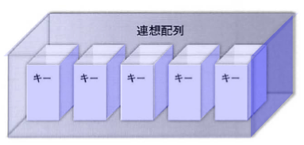
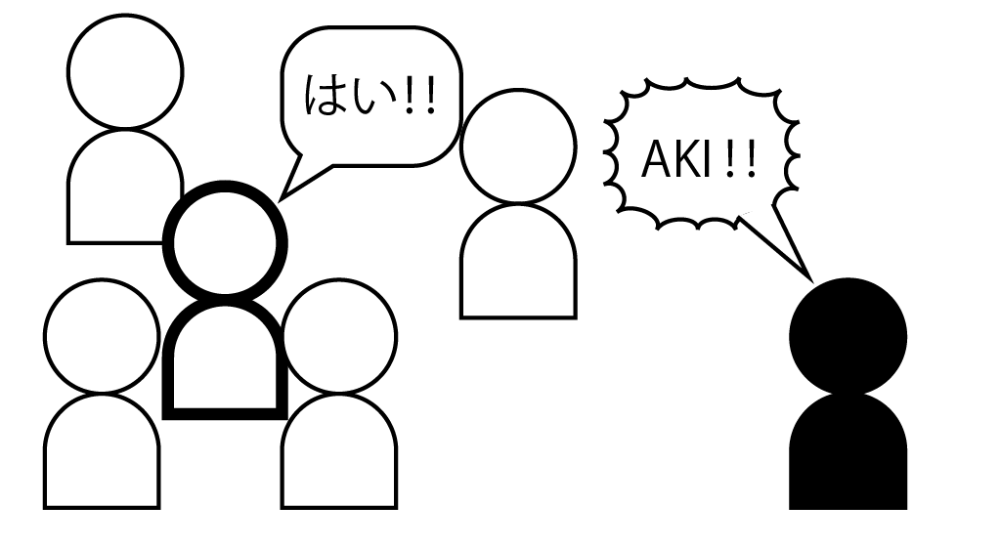
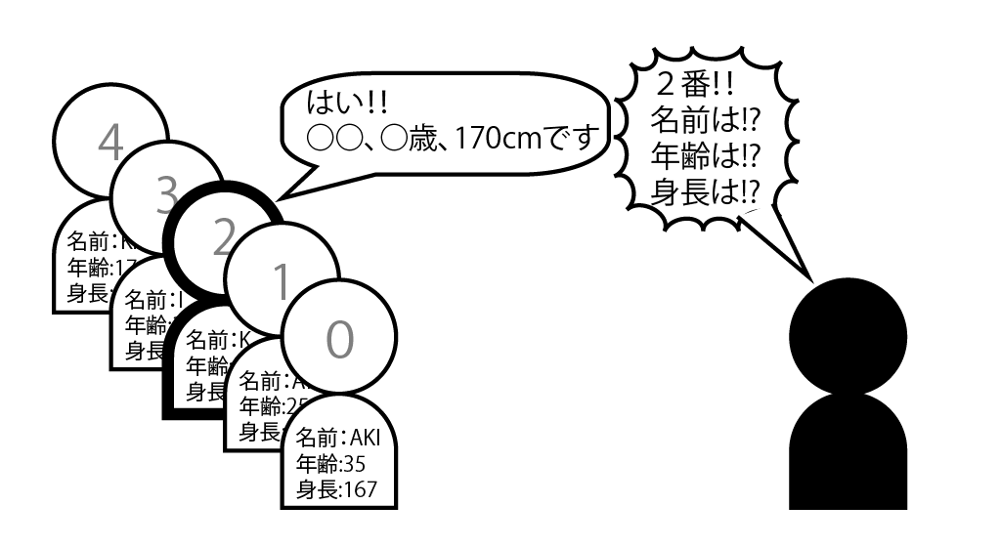

# 連想配列

* 配列はデータに番号をつけてメモリに格納
* 連想配列は、**データとキーを関連させて保存する**もの
* 番号(数値)の代わりにキー(文字列)を付けて格納する

## 連想配列の作成

### 連想配列とは

* 「連想配列」も、配列と同じように複数のデータを格納できる箱を持っている
* 各箱に任意の名前(キー) を付けることで箱を識別可能
* キーとデータを関連付けて保管したいときに連想配列を利用する
* 例えば、会員1 人分の名前や住所、電話番号などのデータを操作するときに便利に活用可能






### 連想配列に名前をつける

* 連想配列は配列や変数と同じ規則が適用される
* `$`を変数名の先頭につける

```text
// PHP
$変数名

// javascript
var 変数名
```

## 連想配列の利用

### データを格納する

* 連想配列$dataにデータを格納するには`$data`と、キーとなる文字列`[name]`を記述する
* キーは文字列なので、`"`で囲う
* あとは、変数や配列と同じように`=`(代入演算子)を使って、値を代入する

```text
// PHP
$data["name"] = "AKI";

// javascript
var data = [];  // 空の配列変数の作成
data['name'] = 'AKI'; // 要素を追加
```

* ここでは「AKI」という名前(文字列)を代入している
    * 連想配列も変数や配列と同じように文字列でも数値でもそのまま代入可能
    * 数値の場合は`"`は付けない
    
### データを出力する

* 連想配列に格納したデータを参照するには、連想配列のキーを利用する
* 格納されたデータを参照するには、このキー「family_name」を指定して`$data["name"]`とする

```text
// PHP
echo $data["name"];
// javascript
document.write(data['name']);
```

### データを追加する

* データを追加するときは、同じようにキーを指定して値を代入する
* 配列のように`$dataArr[]`は使用しない
    * キー「age」には年齢を関連づけ、キー「tall」には身長を関連付けて格納する
    * それぞれecho関数で出力して確認可能

```text
// PHP
$data["name"] = "AKI";
$data["age"]  = 29;
echo $data["name"];
echo $data["age"];

// javascript
var data = [];
data['name'] 	= 'AKI';
data['age']	= 29;

document.write(dataArr['name'] + '<br>');
document.write(dataArr['age'] + '<br>');
```

### まとめて作成する

* 連想配列をまとめて作成するには`=>`を使ってキーと値の関連づけをする
* キーとデータを`キー => データ`のように指定する
* 各データとキーの組み合わせを`,`(カンマ)で区切る

```
$data = [
    キー1 => データ1,
    キー2 => データ2,
    キー3 => データ3
    …
];
```

### データを格納する

```text
$data = [
    "name" => "AKI",
    "age"  => 29,
];
echo $data["name"];
echo $data["age"];
```

* 上記のコードのようにデータごとに適宜改行を入れて見やすくすることも可能

### 配列と連想配列

* 配列と連想配列は、実はPHPから見ると同じ一つの配列型のことを指していて、双方に違いはない
* 理解しやすいように、配列と連想配列を別々に説明していますが、使用法については全く同じもの
* 配列を連想配列のように記述すると以下のように、キーの部分が数値になる

```text
$weeks  = ["月", "火", "水", "木", "金", "土", "日"];
$weeks  = [0 => "月", 1 => "火", 2 => "水", 3 => "木", 4 => "金", 5 => "土", 6 => "日"];
```
