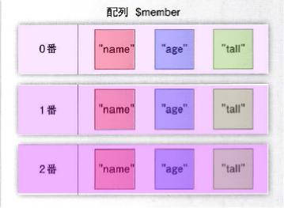
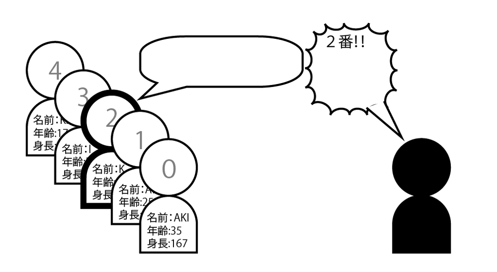

# 多次元配列

## 多次元配列とは

* 配列と連想配列を組み合わせたもの
* データベースを扱う際、配列と連想配列を組み合わせたデータ構造を頻繁に使用する
* 多次元配列とは**配列と連想配列の組み合わせ**



* 配列と連想配列を組み合わせることで会員名簿一覧などを表示する場合に非常に便利にデータを扱えるようになる
    * 図のように配列のそれぞれのインデックスに連想配列が一つずつそのまま格納されている
    * これにより、会員名簿の一人ずつのデータを操作可能



## データを格納する

* 多次元配列にデータを格納するには、配列`$dataArr[]`に、array関数を使って作成した連想配列を代入する
* れにより、インデックス0番に連想配列が格納される

```text
// PHP
$data[] = ["name" => "AKI", "age" => 29, "tall" => 167];

//「$dataArr[0]」とインデックスを指定して代入しても同じ結果になります。
$data[0] = ["name" => "AKI", "age" => 29, "tall" => 167];

// javascript
var data = [ ['製品名','価格'], ['iPhone', 86800], ['iPad', 53800] ];
```

## データを参照する

* 多次元配列のデータの参照は、`$dataArr[0]["name"]`のように、インデックスを「0番」と指定して、次に連想配列のキーを「name」と指定することで参照可能

```text
echo $data[0]["name"];
echo $data[0]["age"];
echo $data[0]["tall"];
```

## 配列のデータをすべて変数に格納する

* 配列に格納されているデータをその順番で変数にすべて格納可能
* 関数から複数の返り値を受け取るときなどに利用する
* まず、配列のデータを右辺に置き、代入演算子で左辺のlist関数の引数として指定されている変数に格納される
* 例では、配列$dataにデータを格納して、次の式の右辺に指定して、list関数の引数に指定されている各変数に配列の順番通りに格納する

```text
$data = ["りんご", "みかん", "かき"];
list($fruit0, $fruit1, $fruit2) = $data;
</pre>
<p style="color:red;">インデックスを指定して各変数に代入する処理と同じです。</p>
<pre class="brush:php;">
$fruit0 = $data[0];
$fruit1 = $data[1];
$fruit2 = $data[2];
```

* 多次元配列の作成
    * https://github.com/aki-creatist/php_beginner/blob/master/var/www/html/array/example.php