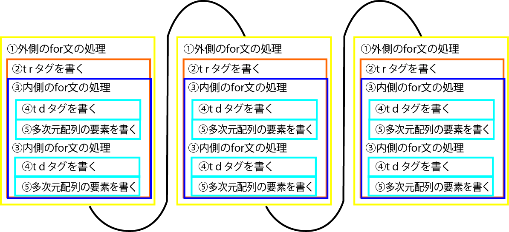

# for

* for文は**使って指定した回数だけ処理を繰り返す**ことができる
    * 例えば、決まった件数だけ名簿を表示するような処理を作成可能
* for文は、
    * 初期化式、条件式、増減式を`;`で区切って指定して、繰り返す回数を設定可能
        * 初期化式
            * 初期化式はループ処理が初めて開始される時、無条件で実行される
            * ２周目でも実行されてしまうと無限ループしてしまうため
        * 条件式
            * 処理が繰り返されるたびに条件式でその数値を判定する
            * 結果がTRUEの場合、次の処理を実行する
        * 増減式
            * 処理が実行された後に、増減式によって、初期化式の数値を決めた数だけ増減して、次の処理の前に条件式判定する
            * 判定の結果TRUEであれば処理を繰り返し、FALSEならループを抜ける

```text
for ( カウンタ変数の初期化; 繰り返し条件の式; カウンタを増減する式 ) {
    繰り返したい処理;
}
```

## for文の動作を確認する

* for文に続くカッコの間に、繰り返しの条件を記述する

```text
for ($i = 1; $i < 5; $i++) echo $i; // 1234
```

* 表示が終わった後に、`$i++`によって、$iに格納されていた値`1`に`1`が加算されて、`2`になる
* 処理の初めに戻って、条件式で$iを判定する
* `$i`は`2`なので、「5」よりも小さいため、処理が繰り返される
    * この例では4回繰り返され、$iが「5」になったときにループを抜けることになる

```text
for ($i = 0; $i <= 1; $i += 0.1) echo $i;
```

## 配列の展開

* https://github.com/aki-creatist/php_beginner/blob/master/var/www/html/array/js_object.html

## 入れ子のfor文

* 多次元配列の要素にアクセスするには入れ子のfor文を使う
* for文を２重の入れ子にした場合、外側のfor文の処理が１回実行されるたびに内側のfor文が複数回実行される
* [サンプル](https://github.com/aki-creatist/php_beginner/blob/master/var/www/html/loop/for.php)

| 製品名 | 価格 |
|:----|:----|
| iPhone | 86800 |
| iPad | 53800 |

* 実行された結果、次のHTMLが書き出され、表が作成される

```html
<table>
<tr><td>製品名</td><td>価格</td></tr>
<tr><td>iPhone</td><td>86800</td></tr>
<tr><td>iPad</td><td>53800</td></tr>
</table>
```



* 入れ子のfor文を書くときは、カウンタ変数の名前を変えるようにする
* 両方とも同じ変数名だと、内側のfor文の加減算によって、外側のfor文のカウンタ変数の値が変化してしまい、意図通りの繰り返しにならない

## プルダウンメニューを作成

* https://github.com/aki-creatist/RegularExpression/blob/master/var/www/html/README.md#pulldown

## プルダウンメニューの作成２(都道府県)

```php
<?php
$prefecture_list = [
    "北海道","青森県","岩手県","宮城県","秋田県",
    "山形県","福島県","茨城県","群馬県","栃木県",
    "埼玉県","千葉県","東京都","神奈川県","新潟県",
    "富山県","石川県","福井県","山梨県","長野県",
    "岐阜県","静岡県","愛知県","三重県","滋賀県",
    "京都府","大阪府","兵庫県","奈良県","和歌山県",
    "鳥取県","島根県","岡山県","広島県","山口県",
    "徳島県","香川県","愛媛県","高知県","福岡県",
    "佐賀県","長崎県","熊本県","大分県","宮崎県",
    "鹿児島県","沖縄県"];

$html = "<SELECT name=\"prefecture\" >\n";
for ($i = 0; $i <= count($prefecture_list) - 1 ; $i++) {
    $html .= "<OPTION value=\"$i\">$prefecture_list[$i]</OPTION>\n";
}
$html .= "</SELECT>\n";

echo $html;
?>
```

* https://github.com/aki-creatist/php_beginner/blob/master/var/www/html/loop/pulldown_prefectures.php

## 多次元配列からテーブル作成

* Javascript
    * https://github.com/aki-creatist/php_beginner/blob/master/var/www/html/array/js_array.html
* PHP
    * https://github.com/aki-creatist/php_beginner/blob/master/var/www/html/array/php_array01.php
